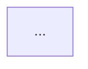

# Excalidraw Diagram Creation Guide

This guide provides exact specifications for creating professional Excalidraw diagrams for the ResearcherAI book.

## Quick Start

1. Go to https://excalidraw.com
2. Follow the specifications below for each diagram
3. Use the hand-drawn style with sketchy roughness
4. Export as SVG: File > Export image > SVG (embedded fonts)
5. Save to `static/img/diagrams/`

## Color Palette

Use consistent colors across all diagrams:

- **Green** (#90EE90): Start nodes, user input, success states
- **Blue** (#87CEEB): Processing nodes, main workflow
- **Purple** (#DDA0DD): Storage, databases, persistence
- **Gold** (#FFD700): Decision points, optional services
- **Pink** (#FFB6C1): End nodes, outputs, agents
- **Light Blue** (#E6F3FF): Background for orchestration layer
- **Light Orange** (#FFF4E6): Background for data/document layer

## Typography

- **Headings**: Bold, 18-20px
- **Labels**: Regular, 14-16px
- **Arrows**: 2-3px stroke
- **Boxes**: 2px stroke, rounded corners

## Diagram 1: Multi-Agent System Overview
**File**: `multi-agent-overview.excalidraw` / `multi-agent-overview.svg`
**Size**: 1200x900px
**Reference**: `docs/architecture.md` lines 16-48

### Layout

```
                [User Query] (Green rounded rectangle)
                      ↓
            [OrchestratorAgent] (Blue rectangle)
                      ↓
        ┌─────────────┼─────────────┐
        ↓             ↓             ↓
   [DataCollector] [GraphAgent] [VectorAgent] ... (5 agents, pink)
        ↓             ↓             ↓
        └─────────────┼─────────────┘
                      ↓
              {Kafka Event Bus} (Gold diamond - optional)
                      ↓
            ┌─────────┴─────────┐
            ↓                   ↓
    [(Graph DB)]        [(Vector DB)]
    [Neo4j/NetworkX]    [Qdrant/FAISS]
    (Purple cylinders)  (Purple cylinders)
```

### Elements

1. **User Query** (Top)
   - Shape: Rounded rectangle
   - Fill: #90EE90 (green)
   - Text: "User Query" (bold, centered)
   - Size: 200x60px

2. **OrchestratorAgent**
   - Shape: Rectangle
   - Fill: #87CEEB (blue)
   - Text: "OrchestratorAgent\n(Coordinator)"
   - Size: 250x80px

3. **Five Agent Boxes** (Horizontal row)
   - All same size: 180x70px
   - Fill: #FFB6C1 (pink)
   - Names:
     - DataCollectorAgent
     - KnowledgeGraphAgent
     - VectorAgent
     - ReasoningAgent
     - SchedulerAgent

4. **Kafka Event Bus** (Optional diamond)
   - Shape: Diamond
   - Fill: #FFD700 (gold)
   - Text: "Kafka Event Bus\n(Optional)"
   - Size: 200x100px

5. **Database Cylinders** (Bottom)
   - Shape: Cylinder (use ellipse + rectangle)
   - Fill: #DDA0DD (purple)
   - Left: "Graph DB\nNeo4j/NetworkX"
   - Right: "Vector DB\nQdrant/FAISS"
   - Size: 180x120px each

6. **Arrows**
   - Solid arrows (→) for main flow
   - Dashed arrows (⇢) for optional connections
   - Width: 2-3px
   - Color: #333333

### Annotations

- Add small text "Direct DB Access" near dashed lines from agents to DBs
- Add "Event-Driven (Async)" near Kafka if space permits

## Diagram 2: LangGraph Workflow
**File**: `langgraph-workflow.excalidraw` / `langgraph-workflow.svg`
**Size**: 1000x1200px (vertical)
**Reference**: `docs/frameworks.md` lines 71-90

### Layout (Top to Bottom)

```
    [Start] (Green oval)
       ↓
    [Data Collection]
       ↓
    [Graph Processing]
       ↓
    [Vector Processing]
       ↓
    [LlamaIndex Indexing] (Purple)
       ↓
    [Reasoning] (Blue)
       ↓
    [Self-Reflection]
       ↓
    [Critic Review]
       ↓
    {Quality Check?} (Gold diamond)
    ↙          ↘
[Correction]    [End] (Pink oval)
    ↓
    (loops back to Reasoning)
```

### Elements

1. **Start Node**
   - Shape: Oval
   - Fill: #90EE90 (green)
   - Text: "Start"
   - Size: 150x60px

2. **Processing Nodes** (Sequential)
   - Shape: Rectangles with rounded corners
   - Fill: #87CEEB (blue) - except where noted
   - Text: Node names
   - Size: 250x70px each
   - Spacing: 40px between nodes

3. **LlamaIndex Node**
   - Fill: #DDA0DD (purple)
   - Text: "LlamaIndex Indexing Node"

4. **Reasoning Node**
   - Fill: #87CEEB (brighter blue)
   - Text: "Reasoning Node"
   - Add small note: "Uses multi-source context"

5. **Quality Check Decision**
   - Shape: Diamond
   - Fill: #FFD700 (gold)
   - Text: "Quality Check\nScore >= 0.75?"
   - Size: 200x120px

6. **End Node**
   - Shape: Oval
   - Fill: #FFB6C1 (pink)
   - Text: "End"
   - Size: 150x60px

7. **Correction Node**
   - Shape: Rectangle
   - Fill: #FFA07A (light orange - indicates retry)
   - Text: "Correction Node"
   - Arrow loops back to Reasoning

### Arrows

- Solid black arrows (2px) for main flow
- Labeled arrows from decision diamond:
  - "Score >= 0.75" → End
  - "Score < 0.75" → Correction
- Curved arrow from Correction back to Reasoning

## Diagram 3: LlamaIndex RAG Pipeline
**File**: `llamaindex-pipeline.excalidraw` / `llamaindex-pipeline.svg`
**Size**: 1400x600px (wide, horizontal)
**Reference**: `docs/frameworks.md` lines 596-616

### Layout (Left to Right with Two Parallel Flows)

```
┌─── INDEXING PIPELINE ────────────────┐
│                                      │
│  [Documents] → [Chunking] →          │
│  [Embeddings] → [(Vector Index)]     │
│                                      │
└──────────────────────────────────────┘

┌─── QUERY PIPELINE ───────────────────┐
│                                      │
│  [User Query] → [Retrieval] ↑        │
│  [Ranking] → [Synthesis] → [Answer]  │
│                                      │
└──────────────────────────────────────┘
         (Vector Index connects to Retrieval with dotted line)
```

### Elements

**Indexing Pipeline** (Top section, light blue background #E6F3FF)

1. **Documents**
   - Shape: Rectangle
   - Fill: #90EE90 (green)
   - Text: "Documents"
   - Size: 150x70px

2. **Chunking**
   - Shape: Rectangle
   - Fill: #87CEEB (blue)
   - Text: "Chunking\n512 tokens\n50 overlap"
   - Size: 150x90px

3. **Embeddings**
   - Shape: Rectangle
   - Fill: #87CEEB (blue)
   - Text: "Embeddings\nall-MiniLM-L6-v2"
   - Size: 150x90px

4. **Vector Index**
   - Shape: Cylinder
   - Fill: #DDA0DD (purple)
   - Text: "Vector Index\n(Qdrant)"
   - Size: 150x100px

**Query Pipeline** (Bottom section, light orange background #FFF4E6)

5. **User Query**
   - Shape: Rounded rectangle
   - Fill: #87CEEB (blue)
   - Text: "User Query"
   - Size: 150x70px

6. **Retrieval**
   - Shape: Rectangle
   - Fill: #87CEEB (blue)
   - Text: "Retrieval\ntop-k=5"
   - Size: 150x70px

7. **Ranking**
   - Shape: Rectangle
   - Fill: #87CEEB (blue)
   - Text: "Ranking\nSimilarity > 0.7"
   - Size: 150x90px

8. **Synthesis**
   - Shape: Rectangle
   - Fill: #87CEEB (blue)
   - Text: "Response\nSynthesis\n(compact mode)"
   - Size: 150x90px

9. **Answer**
   - Shape: Rounded rectangle
   - Fill: #FFB6C1 (pink)
   - Text: "Final Answer"
   - Size: 150x70px

### Connections

- Solid arrows within each pipeline
- Dashed arrow from Vector Index to Retrieval (labeled "Search")
- Group boxes with light backgrounds for each pipeline
- Add "INDEXING PIPELINE" and "QUERY PIPELINE" headers

## Diagram 4: Framework Integration
**File**: `framework-integration.excalidraw` / `framework-integration.svg`
**Size**: 1200x800px
**Reference**: `docs/frameworks.md` lines 1196-1232

### Layout (Two Layers)

```
┌─── LANGGRAPH WORKFLOW (Orchestration Layer) ───┐
│                                                 │
│   [data_collection] → [llamaindex_indexing] →  │
│   [reasoning] → [self_reflection] → [END]      │
│                                                 │
└─────────────────────────────────────────────────┘
            ↕ (labeled connections)
┌─── LLAMAINDEX RAG (Document Intelligence) ─────┐
│                                                 │
│   [Document Indexing] → [Vector Storage] →     │
│   [Semantic Retrieval] → [Response Synthesis]  │
│                                                 │
└─────────────────────────────────────────────────┘
```

### Elements

**LangGraph Layer** (Top, light blue background #E6F3FF)

1. **Four workflow nodes**
   - Shape: Rectangles with rounded corners
   - Fill: #87CEEB (blue)
   - Text: Node names
   - Size: 180x70px each
   - Horizontal arrangement

2. **llamaindex_indexing node**
   - Fill: #DDA0DD (purple - to show LlamaIndex connection)

**LlamaIndex Layer** (Bottom, light orange background #FFF4E6)

3. **Four processing stages**
   - Shape: Rectangles
   - Fill: #87CEEB (blue)
   - Text: Stage names
   - Size: 180x70px each

4. **Vector Storage**
   - Fill: #DDA0DD (purple)
   - Text: "Vector Storage\nQdrant"

### Cross-Layer Connections

- Dashed arrows between layers with labels:
  - llamaindex_indexing → Document Indexing: "Index Docs"
  - reasoning → Semantic Retrieval: "Query"
  - Response Synthesis → reasoning: "Results"

### Annotations

- Add layer labels: "Orchestration Layer" and "Document Intelligence Layer"
- Small note: "State managed by LangGraph, Docs by LlamaIndex"

## Diagram 5: Multi-Modal RAG Architecture
**File**: `multimodal-architecture.excalidraw` / `multimodal-architecture.svg`
**Size**: 1600x1000px (largest, most complex)
**Reference**: `docs/conclusion.md` lines 371-411

### Layout (5 Subgraphs, Left to Right)

```
[Input Processing] → [Encoding] → [Storage] → [Retrieval] → [Generation]
```

### Subgraph 1: Input Processing

**Background**: Light green #E8F5E9

1. **PDF Document** (top)
   - Shape: Rectangle with document icon
   - Fill: #90EE90
   - Text: "Research Paper PDF"

2. **Four extraction nodes** (vertical)
   - Text Extraction
   - Image Extraction
   - Table Extraction
   - Equation Extraction
   - All blue #87CEEB, 150x60px

### Subgraph 2: Multi-Modal Encoding

**Background**: Light blue #E3F2FD

1. **Four embedding nodes** (vertical)
   - Text Embeddings (all-MiniLM-L6-v2)
   - Vision Embeddings (CLIP/ViT)
   - Table Embeddings (TaPas)
   - Math Embeddings (MathBERT)
   - All blue #87CEEB, 200x80px

### Subgraph 3: Storage

**Background**: Light purple #F3E5F5

1. **Qdrant Database** (center)
   - Shape: Large cylinder
   - Fill: #DDA0DD
   - Text: "Qdrant Vector DB\nMulti-Modal Collections"
   - Size: 250x150px

2. **Four collection labels** (around cylinder)
   - research_papers_text
   - research_papers_images
   - research_papers_tables
   - research_papers_equations

### Subgraph 4: Retrieval

**Background**: Light cyan #E0F7FA

1. **User Query** (top)
   - Fill: #87CEEB
   - 150x60px

2. **Query Encoding**
   - Fill: #87CEEB
   - 180x70px

3. **Cross-Modal Search**
   - Fill: #FFD700 (gold - important node)
   - Text: "Cross-Modal Search\nHybrid Retrieval"
   - 200x80px

4. **Results** (bottom)
   - Fill: #87CEEB
   - Text: "Text + Images + Tables"

### Subgraph 5: Generation

**Background**: Light pink #FCE4EC

1. **Vision-Language Model**
   - Shape: Hexagon or distinctive shape
   - Fill: #87CEEB
   - Text: "Vision-Language Model\nGPT-4V / Gemini Vision"
   - Size: 250x100px

2. **Comprehensive Answer**
   - Shape: Rounded rectangle
   - Fill: #FFB6C1 (pink)
   - Text: "Comprehensive Answer\nwith Visual References"
   - Size: 250x80px

### Connections

- Solid arrows within subgraphs
- Bold arrows between subgraphs
- Dashed arrow from Storage to Retrieval (labeled "Search")
- Multiple thin arrows from all encodings to Storage

### Annotations

- Label each subgraph clearly
- Add small technical details where space permits
- Include dimension info: "384-dim", "768-dim" near embeddings

## Export Settings

For all diagrams:

1. **File > Export image**
2. Select **SVG** format
3. Check **Embed fonts** (important!)
4. Check **Include background**
5. Scale: **2x** for high resolution
6. Click **Export**

## File Naming Convention

- Excalidraw source: `diagram-name.excalidraw`
- Exported SVG: `diagram-name.svg`
- Both files go in `static/img/diagrams/`

## Quality Checklist

Before finalizing each diagram:

- [ ] Consistent color palette used
- [ ] Text is readable at 100% zoom
- [ ] Arrows are clearly directional
- [ ] No overlapping text or elements
- [ ] Background colors distinguish sections
- [ ] Hand-drawn style (roughness: 1-2)
- [ ] Exported at 2x resolution
- [ ] SVG fonts embedded
- [ ] File size reasonable (< 500KB)

## Integration with Book

After creating diagrams, update markdown files:

```markdown
<!-- Replace Mermaid code blocks with: -->


*Figure 1: ResearcherAI multi-agent system architecture showing orchestration flow*

<!-- Keep Mermaid as fallback in collapsible section: -->

<details>
<summary>View as Mermaid diagram (interactive)</summary>



</details>
```

## Tips for Best Results

1. **Use consistent spacing**: 40-50px between elements
2. **Align elements**: Use Excalidraw's alignment tools
3. **Group related items**: Select multiple items and group them
4. **Label arrows**: Add small text near arrows for clarity
5. **Use shadows**: Light shadow on boxes for depth
6. **Test exports**: Export at 1x and 2x to compare quality
7. **Version control**: Save .excalidraw files for future edits

## Time Estimate

- Diagram 1 (Multi-Agent): 30 minutes
- Diagram 2 (LangGraph): 25 minutes
- Diagram 3 (LlamaIndex): 30 minutes
- Diagram 4 (Integration): 25 minutes
- Diagram 5 (Multi-Modal): 45 minutes

**Total**: ~2.5 hours for all five diagrams

## Next Steps

1. Create diagrams following specs above
2. Export as SVG with embedded fonts
3. Save to `static/img/diagrams/`
4. Update markdown files to reference SVGs
5. Keep Mermaid as interactive fallback
6. Commit both .excalidraw and .svg files
7. Verify in book build
