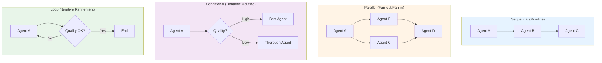

# Chapter 3.5: Agent Foundations - From ReAct to Multi-Agent Systems

## Introduction

Before diving into production multi-agent systems, we need to understand how agents work from the ground up. This chapter traces the evolution from simple ReAct agents to sophisticated multi-agent orchestration, showing you each step of the journey.

:::tip For Web Developers
Think of this progression like learning web development: starting with vanilla JavaScript, then jQuery, then React, then Next.js. Each level builds on the previous, adding structure and capabilities. We're doing the same for AI agents.
:::

## What is an Agent?

An **agent** is a program that:
1. **Perceives** its environment (receives input)
2. **Reasons** about what to do (makes decisions)
3. **Acts** on the environment (executes actions)
4. **Learns** from outcomes (improves over time)

**Simple Example**:
```python
def simple_agent(user_question: str) -> str:
    """A basic agent that just calls an LLM"""
    response = llm.generate(user_question)
    return response
```

**Problem**: This isn't really an "agent" - it's just an LLM call. It can't use tools, check facts, or break down complex tasks.

## The ReAct Pattern: Reasoning + Acting

**ReAct** (Reasoning and Acting) is a foundational pattern that makes LLMs act like true agents. Published in 2022, it interleaves reasoning and action steps.

### How ReAct Works

```
Thought: I need to find current weather data
Action: search_weather("San Francisco")
Observation: Temperature is 65°F, partly cloudy
Thought: Now I can answer the user's question
Action: finish("The weather in San Francisco is 65°F and partly cloudy")
```

**Key Insight**: By making the model *think out loud* before acting, we get:
- Better decision making
- Transparency (we see the reasoning)
- Error correction (model can reconsider)

### Implementing Basic ReAct

```python
from typing import List, Dict, Callable
import google.generativeai as genai

class ReactAgent:
    """Basic ReAct agent with tool calling"""

    def __init__(self, tools: Dict[str, Callable]):
        self.tools = tools
        self.model = genai.GenerativeModel('gemini-1.5-flash')

    def run(self, task: str, max_iterations: int = 5) -> str:
        """Execute ReAct loop"""

        conversation_history = []

        for iteration in range(max_iterations):
            # Generate thought and action
            prompt = self._build_prompt(task, conversation_history)
            response = self.model.generate_content(prompt)

            # Parse response
            thought, action, action_input = self._parse_response(response.text)

            print(f"Thought: {thought}")
            print(f"Action: {action}({action_input})")

            # Execute action
            if action == "finish":
                return action_input

            if action in self.tools:
                observation = self.tools[action](action_input)
                print(f"Observation: {observation}\n")

                # Add to history
                conversation_history.append({
                    "thought": thought,
                    "action": action,
                    "action_input": action_input,
                    "observation": observation
                })
            else:
                print(f"Error: Unknown action '{action}'")
                break

        return "Task incomplete after max iterations"

    def _build_prompt(self, task: str, history: List[Dict]) -> str:
        """Build ReAct prompt with tools description"""

        tools_desc = "\n".join([
            f"- {name}: {func.__doc__}"
            for name, func in self.tools.items()
        ])

        prompt = f"""You are an agent that can use tools to solve tasks.

Available tools:
{tools_desc}

Your response must follow this format:
Thought: <your reasoning>
Action: <tool_name>
Action Input: <input for the tool>

Or to finish:
Thought: <final reasoning>
Action: finish
Action Input: <final answer>

Task: {task}

"""

        # Add conversation history
        for step in history:
            prompt += f"""Thought: {step['thought']}
Action: {step['action']}
Action Input: {step['action_input']}
Observation: {step['observation']}

"""

        prompt += "Thought:"
        return prompt

    def _parse_response(self, response: str) -> tuple:
        """Extract thought, action, and input from response"""
        lines = response.strip().split('\n')

        thought = ""
        action = ""
        action_input = ""

        for line in lines:
            if line.startswith("Thought:"):
                thought = line.replace("Thought:", "").strip()
            elif line.startswith("Action:"):
                action = line.replace("Action:", "").strip()
            elif line.startswith("Action Input:"):
                action_input = line.replace("Action Input:", "").strip()

        return thought, action, action_input
```

### Using the ReAct Agent

```python
# Define tools
def search_papers(query: str) -> str:
    """Search for academic papers on arXiv"""
    # Simplified for example
    return f"Found 3 papers about '{query}'"

def get_paper_abstract(paper_id: str) -> str:
    """Get the abstract of a specific paper"""
    return f"Abstract of paper {paper_id}: This paper discusses..."

# Create agent with tools
agent = ReactAgent(tools={
    "search_papers": search_papers,
    "get_paper_abstract": get_paper_abstract,
    "finish": lambda x: x
})

# Run task
result = agent.run("Find recent papers about multi-agent systems")
```

**Output**:
```
Thought: I need to search for papers about multi-agent systems
Action: search_papers
Action Input: multi-agent systems
Observation: Found 3 papers about 'multi-agent systems'

Thought: I found relevant papers, I can provide the answer
Action: finish
Action Input: I found 3 recent papers about multi-agent systems on arXiv
```

:::tip Why This Matters
ReAct transforms a passive LLM into an active agent that can interact with the world through tools. This is the foundation of all agent systems.
:::

## System Prompts: Giving Agents Identity

System prompts define an agent's behavior, personality, and capabilities.

### Anatomy of a Good System Prompt

```python
RESEARCHER_SYSTEM_PROMPT = """You are a research assistant specialized in academic literature.

Your capabilities:
- Search academic databases (arXiv, Semantic Scholar, PubMed)
- Extract and summarize research papers
- Identify relationships between papers
- Provide citations in proper format

Your behavior:
- Always cite sources with paper IDs
- Admit when you don't know something
- Break complex questions into steps
- Verify information before responding

Your limitations:
- Cannot access papers behind paywalls
- Cannot read full PDFs (only abstracts and metadata)
- Information is current as of your last update

When responding:
1. Think through the problem step-by-step
2. Use tools to gather information
3. Synthesize findings clearly
4. Provide citations
"""
```

### Integrating System Prompts with ReAct

```python
class ReactAgent:
    """ReAct agent with system prompt"""

    def __init__(self, tools: Dict[str, Callable], system_prompt: str):
        self.tools = tools
        self.system_prompt = system_prompt
        self.model = genai.GenerativeModel(
            'gemini-1.5-flash',
            system_instruction=system_prompt  # System prompt here
        )

    def run(self, task: str, max_iterations: int = 5) -> str:
        # System prompt is automatically prepended to all messages
        # Rest of implementation same as before
        pass
```

**Impact**: System prompts make agents:
- More reliable (consistent behavior)
- More focused (stay on task)
- More transparent (explain their reasoning)
- More controllable (follow rules)

## Tool Integration: Extending Agent Capabilities

Tools are functions that agents can call to interact with the external world.

### Types of Tools

**1. Information Retrieval**
```python
def search_arxiv(query: str, max_results: int = 5) -> List[Dict]:
    """Search arXiv for papers matching query"""
    import arxiv

    search = arxiv.Search(
        query=query,
        max_results=max_results,
        sort_by=arxiv.SortCriterion.SubmittedDate
    )

    results = []
    for paper in search.results():
        results.append({
            "title": paper.title,
            "authors": [author.name for author in paper.authors],
            "abstract": paper.summary,
            "pdf_url": paper.pdf_url,
            "published": paper.published.isoformat()
        })

    return results
```

**2. Data Processing**
```python
def extract_entities(text: str) -> Dict[str, List[str]]:
    """Extract named entities from text"""
    # Using spaCy or similar
    import spacy
    nlp = spacy.load("en_core_web_sm")
    doc = nlp(text)

    entities = {
        "PERSON": [],
        "ORG": [],
        "DATE": []
    }

    for ent in doc.ents:
        if ent.label_ in entities:
            entities[ent.label_].append(ent.text)

    return entities
```

**3. External APIs**
```python
def query_database(cypher_query: str) -> List[Dict]:
    """Execute Cypher query on Neo4j database"""
    from neo4j import GraphDatabase

    driver = GraphDatabase.driver("bolt://localhost:7687")
    with driver.session() as session:
        result = session.run(cypher_query)
        return [record.data() for record in result]
```

**4. State Modification**
```python
def add_to_memory(key: str, value: str) -> str:
    """Store information in agent's memory"""
    agent_memory[key] = value
    return f"Stored '{key}': {value[:50]}..."
```

### Tool Calling with Modern LLMs

Modern LLMs like Gemini have native tool calling:

```python
import google.generativeai as genai

# Define tool for Gemini
search_tool = genai.protos.Tool(
    function_declarations=[
        genai.protos.FunctionDeclaration(
            name="search_papers",
            description="Search academic databases for research papers",
            parameters=genai.protos.Schema(
                type=genai.protos.Type.OBJECT,
                properties={
                    "query": genai.protos.Schema(
                        type=genai.protos.Type.STRING,
                        description="Search query"
                    ),
                    "max_results": genai.protos.Schema(
                        type=genai.protos.Type.INTEGER,
                        description="Max results"
                    )
                },
                required=["query"]
            )
        )
    ]
)

# Create model with tools
model = genai.GenerativeModel(
    'gemini-1.5-flash',
    tools=[search_tool]
)

# Agent automatically decides when to use tools
chat = model.start_chat()
response = chat.send_message("Find papers about RAG systems")

# Handle tool calls
for part in response.parts:
    if part.function_call:
        function_name = part.function_call.name
        function_args = dict(part.function_call.args)

        # Execute the function
        result = search_papers(**function_args)

        # Send result back to model
        response = chat.send_message(
            genai.protos.Content(
                parts=[genai.protos.Part(
                    function_response=genai.protos.FunctionResponse(
                        name=function_name,
                        response={"result": result}
                    )
                )]
            )
        )
```

:::tip Web Developer Analogy
Tool calling is like API endpoints in a web app. The agent (frontend) calls tools (backend endpoints) to fetch data or perform actions, then uses the results to generate responses.
:::

## From Single Agent to Stateful Workflows

Single-turn ReAct agents work for simple tasks, but complex workflows need:
- **State persistence** (remember past actions)
- **Multiple steps** (break down complex tasks)
- **Error recovery** (retry failed actions)
- **Branching logic** (different paths based on results)

This is where **LangGraph** comes in.

### Why LangGraph?

Traditional ReAct agents have limitations:

```python
# Problem 1: No state persistence
result1 = agent.run("Search for papers on topic X")
result2 = agent.run("Summarize the first paper")  # Agent forgot previous search!

# Problem 2: No branching logic
# Can't say: "If search returns no results, try broader query"

# Problem 3: No error recovery
# If one action fails, entire workflow stops
```

**LangGraph Solution**: Represent workflows as stateful graphs.

### LangGraph Basics

```python
from langgraph.graph import StateGraph, END
from typing import TypedDict

# Define state
class AgentState(TypedDict):
    """State that flows through the workflow"""
    messages: list
    papers: list
    current_query: str
    next_action: str

# Create graph
workflow = StateGraph(AgentState)

# Define nodes (functions that modify state)
def search_node(state: AgentState) -> AgentState:
    """Search for papers"""
    papers = search_papers(state["current_query"])
    state["papers"] = papers
    state["messages"].append(f"Found {len(papers)} papers")
    return state

def summarize_node(state: AgentState) -> AgentState:
    """Summarize papers"""
    summaries = [summarize(p) for p in state["papers"]]
    state["messages"].append(f"Summarized {len(summaries)} papers")
    return state

# Add nodes to graph
workflow.add_node("search", search_node)
workflow.add_node("summarize", summarize_node)

# Define edges (workflow flow)
workflow.set_entry_point("search")
workflow.add_edge("search", "summarize")
workflow.add_edge("summarize", END)

# Compile graph
app = workflow.compile()

# Run workflow (state persists across nodes!)
result = app.invoke({
    "messages": [],
    "papers": [],
    "current_query": "multi-agent systems",
    "next_action": ""
})
```

**Benefits**:
1. **State persists** between nodes
2. **Clear workflow** (visualize as graph)
3. **Composable** (add/remove nodes easily)
4. **Testable** (test each node independently)

### LangGraph with ReAct Tools

Combining LangGraph's state management with ReAct's tool calling:

```python
from langgraph.graph import StateGraph, END
from typing import TypedDict, List

class AgentState(TypedDict):
    messages: List[str]
    intermediate_steps: List[tuple]  # Store (action, observation) pairs

def create_react_langgraph_agent(tools: List):
    """Create a ReAct agent using LangGraph"""

    # Define nodes
    def agent_node(state: AgentState) -> AgentState:
        """Agent decides next action"""
        # Build prompt with history
        prompt = build_prompt(state["messages"], state["intermediate_steps"])

        # Get LLM decision
        response = model.generate_content(prompt)

        # Parse action
        action, action_input = parse_action(response.text)

        state["intermediate_steps"].append((action, action_input))
        return state

    def tool_node(state: AgentState) -> AgentState:
        """Execute the tool"""
        last_action, action_input = state["intermediate_steps"][-1]

        # Execute tool
        observation = execute_tool(last_action, action_input, tools)

        # Add observation to state
        state["intermediate_steps"][-1] = (last_action, action_input, observation)
        return state

    def should_continue(state: AgentState) -> str:
        """Decide if we should continue or finish"""
        last_action = state["intermediate_steps"][-1][0]

        if last_action == "finish":
            return "end"
        else:
            return "continue"

    # Build graph
    workflow = StateGraph(AgentState)

    workflow.add_node("agent", agent_node)
    workflow.add_node("tools", tool_node)

    workflow.set_entry_point("agent")

    workflow.add_conditional_edges(
        "agent",
        should_continue,
        {
            "continue": "tools",
            "end": END
        }
    )

    workflow.add_edge("tools", "agent")  # Loop back for next action

    return workflow.compile()
```

**What's Happening Here**:
1. **agent_node**: LLM decides next action (ReAct reasoning)
2. **tool_node**: Execute the tool (ReAct acting)
3. **Conditional routing**: Continue loop or end (ReAct decision)
4. **State**: Preserves full history (ReAct memory)

:::info Key Insight
LangGraph + ReAct gives you the best of both worlds:
- ReAct's reasoning and tool use
- LangGraph's state management and control flow
:::

## Graph Compilation: Making Workflows Executable

When you call `workflow.compile()`, LangGraph transforms your graph definition into an executable state machine.

### What Happens During Compilation

```python
workflow = StateGraph(AgentState)
workflow.add_node("search", search_node)
workflow.add_node("process", process_node)
workflow.add_edge("search", "process")

# Before compilation: Just a graph definition
print(type(workflow))  # <class 'StateGraph'>

# After compilation: Executable runtime
app = workflow.compile()
print(type(app))  # <class 'CompiledGraph'>
```

**Compilation Steps**:

1. **Validation**: Check all nodes are connected, no orphans
2. **Topological Sort**: Determine execution order
3. **Checkpointing Setup**: Enable state saving
4. **Optimization**: Parallelize independent nodes
5. **Runtime Creation**: Generate executable code

### Understanding Compiled Graphs

```python
from langgraph.graph import StateGraph, END

workflow = StateGraph(AgentState)

# Define workflow
workflow.add_node("start", start_node)
workflow.add_node("branch_a", branch_a_node)
workflow.add_node("branch_b", branch_b_node)
workflow.add_node("merge", merge_node)

workflow.set_entry_point("start")

workflow.add_conditional_edges(
    "start",
    routing_function,
    {
        "a": "branch_a",
        "b": "branch_b"
    }
)

workflow.add_edge("branch_a", "merge")
workflow.add_edge("branch_b", "merge")
workflow.add_edge("merge", END)

# Compile
app = workflow.compile()

# Execution creates a state machine:
# 1. Initialize state
# 2. Execute entry_point node
# 3. Check conditional edges (if any)
# 4. Execute next node
# 5. Update state
# 6. Repeat until END
```

### Checkpointing: State Persistence

```python
from langgraph.checkpoint.memory import MemorySaver

# Compile with checkpointing
checkpointer = MemorySaver()
app = workflow.compile(checkpointer=checkpointer)

# Run with thread ID (for persistence)
config = {"configurable": {"thread_id": "conversation_1"}}

# First invocation
result1 = app.invoke(initial_state, config)

# Later invocation (continues from saved state!)
result2 = app.invoke(new_state, config)
```

**Use Cases**:
- Multi-turn conversations
- Long-running workflows
- Error recovery
- Pause and resume

## Evolution to Multi-Agent Systems

Now that we understand single agents with tools and stateful workflows, let's see how this evolves into multi-agent systems.

### Single Agent Limitations

```python
# Single agent trying to do everything
agent = ReactAgent(tools=[
    search_papers,
    extract_entities,
    build_graph,
    compute_vectors,
    generate_answer
])

# Problems:
# 1. Complex prompts (agent must know about ALL tools)
# 2. Context limits (too much in memory)
# 3. No specialization (jack of all trades, master of none)
# 4. No parallelization (sequential execution)
```

### Multi-Agent Solution: Specialization

Instead of one agent doing everything, create specialized agents:

```python
class DataCollectorAgent:
    """Specialized in collecting papers from sources"""
    tools = [search_arxiv, search_semantic_scholar, search_pubmed]

class KnowledgeGraphAgent:
    """Specialized in building knowledge graphs"""
    tools = [extract_entities, create_relationships, query_graph]

class VectorAgent:
    """Specialized in semantic search"""
    tools = [embed_text, search_vectors, find_similar]

class ReasoningAgent:
    """Specialized in answering questions"""
    tools = [generate_answer, cite_sources, explain_reasoning]
```

**Benefits**:
- **Focused**: Each agent masters its domain
- **Maintainable**: Changes to one agent don't affect others
- **Testable**: Test each agent independently
- **Scalable**: Run agents in parallel

### Multi-Agent Orchestration with LangGraph

```python
from langgraph.graph import StateGraph, END

class MultiAgentState(TypedDict):
    query: str
    papers: List[Dict]
    graph_data: Dict
    vectors: np.ndarray
    answer: str

def create_multi_agent_workflow():
    """Multi-agent system with LangGraph"""

    # Initialize agents
    data_collector = DataCollectorAgent()
    graph_agent = KnowledgeGraphAgent()
    vector_agent = VectorAgent()
    reasoning_agent = ReasoningAgent()

    # Define workflow nodes (one per agent)
    def collect_data_node(state: MultiAgentState) -> MultiAgentState:
        papers = data_collector.collect(state["query"])
        state["papers"] = papers
        return state

    def build_graph_node(state: MultiAgentState) -> MultiAgentState:
        graph = graph_agent.build_graph(state["papers"])
        state["graph_data"] = graph
        return state

    def create_vectors_node(state: MultiAgentState) -> MultiAgentState:
        vectors = vector_agent.embed(state["papers"])
        state["vectors"] = vectors
        return state

    def reason_node(state: MultiAgentState) -> MultiAgentState:
        # Use data from other agents
        context = {
            "papers": state["papers"],
            "graph": state["graph_data"],
            "vectors": state["vectors"]
        }
        answer = reasoning_agent.generate_answer(state["query"], context)
        state["answer"] = answer
        return state

    # Build workflow
    workflow = StateGraph(MultiAgentState)

    workflow.add_node("collect", collect_data_node)
    workflow.add_node("graph", build_graph_node)
    workflow.add_node("vectors", create_vectors_node)
    workflow.add_node("reason", reason_node)

    # Define flow
    workflow.set_entry_point("collect")

    # Parallel execution: graph and vectors can run simultaneously
    workflow.add_edge("collect", "graph")
    workflow.add_edge("collect", "vectors")

    # Both must complete before reasoning
    workflow.add_edge("graph", "reason")
    workflow.add_edge("vectors", "reason")

    workflow.add_edge("reason", END)

    return workflow.compile()
```

**Key Features**:
1. **Specialized Agents**: Each handles one concern
2. **Parallel Execution**: graph and vectors run together
3. **Shared State**: All agents read/write to MultiAgentState
4. **Orchestration**: LangGraph manages coordination

### Coordination Patterns



## Progression Summary

```
Single Function Call
    ↓
ReAct Agent (Reason + Act)
    ↓
ReAct + System Prompts (Controlled behavior)
    ↓
ReAct + Tools (External capabilities)
    ↓
LangGraph + ReAct (Stateful workflows)
    ↓
Multi-Agent LangGraph (Specialized + Coordinated)
    ↓
Production Multi-Agent System (ResearcherAI)
```

Each level adds capabilities while building on previous foundations.

## Key Takeaways

1. **ReAct Pattern**: Foundation for agents that can reason and act
2. **System Prompts**: Define agent behavior and capabilities
3. **Tools**: Extend agents to interact with external world
4. **LangGraph**: Manage complex, stateful workflows
5. **Graph Compilation**: Transform definitions into executables
6. **Multi-Agent Systems**: Specialized agents coordinated by graphs

## Next Steps

Now that you understand agent foundations, you're ready to:
1. **Chapter 4 (Orchestration Frameworks)**: Deep dive into LangGraph and LlamaIndex
2. **Chapter 5 (Backend)**: Implement production agents with databases
3. **Chapter 6 (Frontend)**: Build UIs for multi-agent systems

The foundations you learned here power everything in ResearcherAI. Every concept - from ReAct to graph compilation - is used in the production system.

---

:::tip Practice Exercise
Try building your own agent:
1. Start with basic ReAct
2. Add system prompt for personality
3. Add 2-3 tools (search, calculate, memory)
4. Convert to LangGraph workflow
5. Add a second specialized agent
6. Coordinate with conditional routing

This progression mirrors how ResearcherAI was built!
:::
