# Architecture Design


With requirements in hand, it was time to design the system. This chapter walks through my architecture decisions and why I made them.


## The Big Picture

Here's the 30,000-foot view of ResearcherAI:


Simple, right? Let me break down each component and explain the design decisions.

## Multi-Agent Architecture

### Why Multiple Agents?

I could have built one big agent that does everything. But that would be:
- ❌ Hard to test (too many responsibilities)
- ❌ Hard to scale (can't scale parts independently)
- ❌ Hard to maintain (changes ripple everywhere)
- ❌ Hard to reason about (too complex)

Instead, I followed the **Single Responsibility Principle** and created specialized agents.


### The Six Agents

**1. OrchestratorAgent**
```python
class OrchestratorAgent:
    """Coordinates all other agents and manages sessions"""

    def collect_data(query, sources) -> Result:
        """Orchestrates data collection workflow"""

    def ask(question) -> Answer:
        """Orchestrates RAG query workflow"""

    def save_session() -> None:
        """Persists session state"""
```

**Role**: The conductor of the orchestra
- Receives user requests
- Delegates to specialized agents
- Manages conversation state
- Handles session persistence

**2. DataCollectorAgent**
```python
class DataCollectorAgent:
    """Collects papers from multiple sources"""

    def collect_from_arxiv(query) -> Papers:
    def collect_from_semantic_scholar(query) -> Papers:
    def collect_from_pubmed(query) -> Papers:
    # ... 7 sources total
```

**Role**: The data gatherer
- Queries 7 academic sources
- Handles rate limiting
- Deduplicates results
- Publishes collection events

**3. KnowledgeGraphAgent**
```python
class KnowledgeGraphAgent:
    """Manages knowledge graph (Neo4j or NetworkX)"""

    def add_papers(papers) -> Stats:
    def add_relationship(from, to, type) -> None:
    def query(cypher_or_pattern) -> Results:
    def visualize() -> Graph:
```

**Role**: The knowledge organizer
- Extracts entities (papers, authors, topics)
- Creates relationships
- Supports graph queries
- Generates visualizations

**4. VectorAgent**
```python
class VectorAgent:
    """Manages vector embeddings (Qdrant or FAISS)"""

    def add_documents(docs) -> int:
    def search(query, top_k) -> Results:
    def get_similar(doc_id, top_k) -> Results:
```

**Role**: The semantic searcher
- Generates embeddings
- Stores in vector DB
- Similarity search
- Retrieves relevant context

**5. ReasoningAgent**
```python
class ReasoningAgent:
    """Generates answers using LLM + RAG"""

    def answer(question, context, history) -> Answer:
    def summarize(documents) -> Summary:
```

**Role**: The thinker
- Synthesizes information
- Maintains conversation memory
- Generates citations
- Provides explanations

**6. SchedulerAgent**
```python
class SchedulerAgent:
    """Automates periodic data collection"""

    def start(interval, queries) -> None:
    def stop() -> None:
    def get_stats() -> Stats:
```

**Role**: The automator
- Background data collection
- Configurable schedules
- Health monitoring


## Orchestration Frameworks

While the six agents above handle specific responsibilities, coordinating them requires robust orchestration. ResearcherAI uses two powerful frameworks:

### LangGraph: Workflow Orchestration

**LangGraph** provides stateful workflow orchestration for complex multi-agent interactions:

```python
from langgraph.graph import StateGraph, END

class LangGraphOrchestrator:
    """Stateful workflow management"""

    def _build_workflow(self):
        workflow = StateGraph(AgentState)

        # Define workflow nodes
        workflow.add_node("data_collection", self.data_collection_node)
        workflow.add_node("graph_processing", self.graph_processing_node)
        workflow.add_node("vector_processing", self.vector_processing_node)
        workflow.add_node("llamaindex_indexing", self.llamaindex_indexing_node)
        workflow.add_node("reasoning", self.reasoning_node)
        workflow.add_node("self_reflection", self.self_reflection_node)

        # Connect nodes with edges
        workflow.add_edge("data_collection", "graph_processing")
        workflow.add_edge("graph_processing", "vector_processing")
        # ... more edges

        # Compile with state persistence
        return workflow.compile(checkpointer=MemorySaver())
```

**Key Features**:
- **State Management**: Automatic state flow through workflow nodes
- **Conditional Routing**: Dynamic workflow paths based on runtime conditions
- **Checkpointing**: Built-in conversation persistence across sessions
- **Error Recovery**: Graceful handling of failures with retry mechanisms

**Why LangGraph?**
- Treats workflows as directed graphs (easier to visualize and debug)
- Built-in memory for multi-turn conversations
- Stream processing for real-time progress updates
- Production-ready with minimal boilerplate

:::tip Web Developer Analogy
LangGraph is like a state machine orchestrator for backend workflows - similar to Redux for frontend state management, but for agent coordination.
:::

### LlamaIndex: Advanced RAG Framework

**LlamaIndex** powers the document intelligence layer:

```python
from llama_index.core import VectorStoreIndex, Document
from llama_index.vector_stores.qdrant import QdrantVectorStore

class LlamaIndexRAG:
    """Production-grade RAG system"""

    def index_documents(self, papers: List[Dict]):
        # Convert to LlamaIndex documents
        documents = [
            Document(
                text=paper['abstract'],
                metadata={
                    'title': paper['title'],
                    'authors': paper['authors'],
                    'year': paper['year']
                }
            )
            for paper in papers
        ]

        # Create vector index
        self.index = VectorStoreIndex.from_documents(
            documents,
            storage_context=self.storage_context
        )

    def query(self, question: str, top_k: int = 5):
        # Advanced retrieval with post-processing
        response = self.query_engine.query(question)
        return {
            'answer': str(response),
            'sources': [node.metadata for node in response.source_nodes]
        }
```

**Key Features**:
- **Vector Store Abstraction**: Single API for Qdrant, FAISS, Pinecone, etc.
- **Query Optimization**: Automatic query rewriting and enhancement
- **Response Synthesis**: Multiple strategies (compact, refine, tree_summarize)
- **Metadata Filtering**: Filter by year, author, citations, etc.

**Why LlamaIndex?**
- Abstracts away vector database complexity
- Built-in evaluation metrics for RAG quality
- Advanced retrieval strategies (hybrid search, HyDE, etc.)
- Production-tested across thousands of applications

:::tip Web Developer Analogy
LlamaIndex is like an ORM for documents - similar to how Prisma abstracts database operations, LlamaIndex abstracts document indexing and retrieval.
:::

### Integration: LangGraph + LlamaIndex

The two frameworks work together seamlessly:

```mermaid
graph TB
    subgraph LG[LangGraph Workflow - Orchestration]
        DC[data_collection_node]
        LI[llamaindex_indexing_node]
        RN[reasoning_node]

        DC --> LI
        LI --> RN
    end

    subgraph LL[LlamaIndex RAG - Document Layer]
        DI[Document Indexing]
        VS[Vector Storage - Qdrant]
        SR[Semantic Retrieval]
        RS[Response Synthesis]

        DI --> VS
        VS --> SR
        SR --> RS
    end

    LI -.->|Index Docs| DI
    RN -.->|Query| SR
    RS -.->|Results| RN

    style LG fill:#E6F3FF
    style LL fill:#FFF4E6
    style LI fill:#DDA0DD
    style RN fill:#87CEEB
    style VS fill:#FFD700
```



**Division of Responsibilities**:
- **LangGraph**: Manages workflow state, agent coordination, conversation memory
- **LlamaIndex**: Handles document chunking, embedding, retrieval, and synthesis
- **Together**: Production-grade multi-agent RAG system

**Real-World Benefits**:
```python
# Single query orchestrates everything
orchestrator = LangGraphOrchestrator()
result = orchestrator.process_query(
    query="What are the latest advances in multi-agent systems?",
    thread_id="session_123"  # Conversation memory
)

# Behind the scenes:
# 1. LangGraph routes through workflow nodes
# 2. DataCollector gathers papers from 7 sources
# 3. LlamaIndex indexes documents in Qdrant
# 4. KnowledgeGraph builds relationships
# 5. VectorAgent creates embeddings
# 6. LlamaIndex retrieves relevant context
# 7. ReasoningAgent synthesizes answer
# 8. Self-reflection evaluates quality
# 9. LangGraph persists conversation state
```

**Performance Impact**:
- **First query**: ~28.5s (includes indexing 30+ papers)
- **Follow-up query**: ~2.1s (reuses indexed documents)
- **Memory efficiency**: State checkpointing prevents memory leaks
- **Scalability**: Both frameworks support horizontal scaling

:::info Production Stats
From ResearcherAI production deployment:
- Documents indexed: 1,000+ research papers
- Average retrieval time: 0.8s (LlamaIndex + Qdrant)
- Workflow completion: 24.7s (all 8 LangGraph nodes)
- Answer quality: 0.87/1.0 (LlamaIndex relevance evaluator)
:::

For a deep dive into these frameworks with complete code examples, see [Chapter 4: Orchestration Frameworks](frameworks.md).


## Dual-Backend Strategy

This was one of my favorite architectural decisions.

### The Problem

Development with production infrastructure is painful:

```bash
# Production setup
docker-compose up  # 30 seconds, 7 containers, 4GB RAM
pytest             # 5 minutes (Docker overhead)
```

But I need production infrastructure eventually. How to have both?

### The Solution: Abstraction Layer

I created interfaces that both backends implement:

```python
# Abstract interface
class GraphBackend(ABC):
    @abstractmethod
    def add_node(self, node_id, properties): pass

    @abstractmethod
    def add_edge(self, from_id, to_id, relationship): pass

    @abstractmethod
    def query(self, pattern): pass

# Development backend
class NetworkXBackend(GraphBackend):
    """In-memory graph, instant startup"""
    def __init__(self):
        self.graph = nx.MultiDiGraph()

    def add_node(self, node_id, properties):
        self.graph.add_node(node_id, **properties)

# Production backend
class Neo4jBackend(GraphBackend):
    """Persistent graph, Cypher queries"""
    def __init__(self, uri, user, password):
        self.driver = GraphDatabase.driver(uri, auth=(user, password))

    def add_node(self, node_id, properties):
        self.driver.execute_query(
            "CREATE (n:Node {id: $id}) SET n += $props",
            id=node_id, props=properties
        )
```

Then I select the backend based on environment variables:

```python
if os.getenv("USE_NEO4J") == "true":
    graph = Neo4jBackend(uri, user, password)
else:
    graph = NetworkXBackend()
```

### The Benefits


**Development Mode**
```bash
export USE_NEO4J=false USE_QDRANT=false
python main.py  # Instant startup, no Docker
pytest          # 90 seconds, no infrastructure
```

**Production Mode**
```bash
export USE_NEO4J=true USE_QDRANT=true
docker-compose up  # Full infrastructure
python main.py     # Same code, different backends
```

**Same Code, Different Scale:**
- ⚡ 0s startup vs 30s
- 💰 $0 infra vs $50/month
- 🧪 Fast tests vs slow tests
- 🔄 Zero code changes to switch


## Event-Driven Architecture

### Why Events?

Without events, agents call each other directly:

```python
# Synchronous, tightly coupled
papers = data_collector.collect("transformers")
graph_stats = graph_agent.add_papers(papers)  # Blocks
vector_stats = vector_agent.add_papers(papers)  # Blocks
```

Problems:
- ❌ Graph and vector operations run sequentially (slow)
- ❌ If graph_agent fails, vector_agent never runs
- ❌ Can't replay or debug easily
- ❌ Tight coupling between agents

With events:

```python
# Async, loosely coupled
papers = data_collector.collect("transformers")
event_bus.publish("papers.collected", papers)

# Separate consumers process in parallel
graph_agent.on("papers.collected", add_to_graph)
vector_agent.on("papers.collected", add_to_vectors)
```

Benefits:
- ✅ Graph and vector run in parallel (3x faster)
- ✅ One failure doesn't break everything
- ✅ Can replay events for debugging
- ✅ Loose coupling, easy to add consumers

### Event Topics

I designed 16 event topics organized by workflow:


**Query Lifecycle**
```
query.submitted         → User asks question
query.validated         → Question is valid
query.completed         → Answer generated
query.failed            → Error occurred
```

**Data Collection**
```
data.collection.started   → Collection begins
data.collection.completed → Papers collected
data.collection.failed    → Collection error
```

**Graph Processing**
```
graph.processing.started   → Adding to graph
graph.processing.completed → Graph updated
graph.processing.failed    → Graph error
```

**Vector Processing**
```
vector.processing.started   → Generating embeddings
vector.processing.completed → Vectors stored
vector.processing.failed    → Embedding error
```

**Reasoning**
```
reasoning.started   → LLM invoked
reasoning.completed → Answer generated
reasoning.failed    → LLM error
```

**System**
```
agent.health.check  → Periodic health ping
agent.error         → Critical error
```


### Kafka vs Synchronous

I made Kafka **optional** because:

1. **Development**: Overkill for single-user testing
2. **CI/CD**: Adds complexity to test pipelines
3. **Simple deployments**: Not everyone needs Kafka

The code falls back gracefully:

```python
if kafka_available():
    event_bus = KafkaEventBus()
else:
    event_bus = SynchronousEventBus()  # Direct calls

# Same API for both
event_bus.publish("papers.collected", papers)
```

## RAG Architecture

### The RAG Pipeline

When a user asks a question, here's what happens:

```
1. Question → Embedding
   "What are transformers?"
   → [0.2, -0.5, 0.8, ...]

2. Vector Search → Relevant Chunks
   Top 5 paper chunks about transformers

3. Graph Traversal → Related Entities
   - Paper: "Attention Is All You Need"
   - Authors: Vaswani et al.
   - Topics: attention, seq2seq

4. Context Building → Prompt
   Combine vectors + graph results + history

5. LLM Reasoning → Answer
   Gemini 2.0 synthesizes answer with citations
```

### Why Both Graphs and Vectors?

I get asked this a lot. Why not just one?

**Vectors are great for:**
- ✅ Semantic similarity ("transformers" ≈ "attention mechanisms")
- ✅ Finding relevant passages
- ✅ Fuzzy matching

**But vectors are bad for:**
- ❌ Relationships ("who authored this paper?")
- ❌ Structure ("papers citing this paper")
- ❌ Multi-hop queries ("papers by colleagues of X")

**Graphs are great for:**
- ✅ Relationships and structure
- ✅ Multi-hop traversals
- ✅ Explicit connections

**But graphs are bad for:**
- ❌ Semantic similarity
- ❌ Fuzzy matching
- ❌ Unstructured text search

**Together, they're powerful:**

```python
# Hybrid search
def answer_question(question):
    # 1. Vector search for semantic relevance
    relevant_chunks = vector_agent.search(question, top_k=10)

    # 2. Graph traversal for related entities
    papers = [chunk.paper_id for chunk in relevant_chunks]
    related = graph_agent.get_related(papers, depth=2)

    # 3. Combine both for context
    context = build_context(relevant_chunks, related)

    # 4. LLM generates answer
    return reasoning_agent.answer(question, context)
```

## Session Management

Users need to:
- Work on multiple research topics
- Save progress
- Resume later

I designed a session system:

```python
class Session:
    id: str
    name: str
    created_at: datetime
    papers_collected: int
    conversations: List[Conversation]
    metadata: Dict

class Conversation:
    question: str
    answer: str
    sources: List[str]
    timestamp: datetime
```

Sessions are saved as JSON:

```json
{
  "id": "research-transformers-20251101",
  "name": "Transformer Research",
  "created_at": "2025-11-01T10:00:00Z",
  "papers_collected": 47,
  "conversations": [
    {
      "question": "What are transformers?",
      "answer": "Transformers are...",
      "sources": ["arxiv:1706.03762"],
      "timestamp": "2025-11-01T10:05:00Z"
    }
  ]
}
```

The OrchestratorAgent manages sessions:

```python
# Create new session
orch = OrchestratorAgent("my-research")

# Collect data (adds to session)
orch.collect_data("transformers")

# Ask questions (added to session)
orch.ask("What are transformers?")

# Save session
orch.save_session()

# Load later
orch = OrchestratorAgent("my-research")  # Auto-loads
orch.get_stats()  # Shows history
```

## Production-Grade Patterns

From the start, I implemented patterns that matter at scale.


### 1. Circuit Breakers

Prevent cascade failures when external APIs fail:

```python
class CircuitBreaker:
    def __init__(self, failure_threshold=5, recovery_timeout=60):
        self.failures = 0
        self.threshold = failure_threshold
        self.timeout = recovery_timeout
        self.state = "CLOSED"  # CLOSED, OPEN, HALF_OPEN

    def call(self, func):
        if self.state == "OPEN":
            if time.time() - self.opened_at > self.timeout:
                self.state = "HALF_OPEN"  # Try again
            else:
                raise CircuitBreakerOpen()

        try:
            result = func()
            self.failures = 0
            self.state = "CLOSED"
            return result
        except Exception as e:
            self.failures += 1
            if self.failures >= self.threshold:
                self.state = "OPEN"
                self.opened_at = time.time()
            raise
```

**Result**: 94% error reduction in tests with flaky APIs.


### 2. Token Budgets

Prevent runaway LLM costs:

```python
class TokenBudget:
    def __init__(self, per_request=10000, per_user=100000):
        self.per_request = per_request
        self.per_user = per_user
        self.usage = {}

    def check(self, user_id, estimated_tokens):
        if estimated_tokens > self.per_request:
            raise BudgetExceeded("Request exceeds per-request limit")

        if self.usage.get(user_id, 0) + estimated_tokens > self.per_user:
            raise BudgetExceeded("User exceeds daily limit")

    def record(self, user_id, actual_tokens):
        self.usage[user_id] = self.usage.get(user_id, 0) + actual_tokens
```

**Result**: No surprise bills, predictable costs.


### 3. Intelligent Caching

Dual-tier cache (memory + disk) with TTLs:

```python
class DualTierCache:
    def __init__(self):
        self.memory = {}  # Fast, volatile
        self.disk = diskcache.Cache("./cache")  # Slow, persistent

    def get(self, key):
        # Try memory first
        if key in self.memory:
            return self.memory[key]

        # Fall back to disk
        if key in self.disk:
            value = self.disk[key]
            self.memory[key] = value  # Promote to memory
            return value

        return None

    def set(self, key, value, ttl=3600):
        self.memory[key] = value
        self.disk.set(key, value, expire=ttl)
```

**Result**: 40% cost reduction on repeated queries.


### 4. Dynamic Model Selection

Use the cheapest model that meets requirements:

```python
def select_model(task_type, max_latency=None, min_quality=None):
    models = [
        {"name": "gemini-flash", "cost": 0.35, "latency": 1.5, "quality": 0.85},
        {"name": "gemini-pro", "cost": 1.00, "latency": 2.5, "quality": 0.92},
        {"name": "gpt-4", "cost": 30.00, "latency": 3.0, "quality": 0.95},
    ]

    # Filter by constraints
    candidates = [m for m in models
                  if (not max_latency or m["latency"] <= max_latency)
                  and (not min_quality or m["quality"] >= min_quality)]

    # Sort by cost, return cheapest
    return min(candidates, key=lambda m: m["cost"])
```

**Result**: 70% cost savings vs always using GPT-4.


## Airflow Integration

I added Apache Airflow for production-grade ETL orchestration.

### Why Airflow?

**Before Airflow**: Sequential collection
```python
# Slow, sequential, no retries
for source in sources:
    papers = collect(source)  # Blocks until done
```

**With Airflow**: Parallel DAG
```python
# Fast, parallel, auto-retry
from airflow import DAG
from airflow.operators.python import PythonOperator

with DAG("research_paper_etl"):
    arxiv = PythonOperator(task_id="arxiv", python_callable=collect_arxiv)
    pubmed = PythonOperator(task_id="pubmed", python_callable=collect_pubmed)
    semantic = PythonOperator(task_id="semantic", python_callable=collect_semantic)
    # All run in parallel!
```

**Results**:
- ⚡ 3-4x faster (5-10s vs 19-38s)
- 🔄 Automatic retries with exponential backoff
- 📊 Visual monitoring at http://localhost:8080
- 📈 Scalable with Celery workers

## Architecture Evolution

The architecture didn't start perfect. Here's how it evolved:

**Version 1.0 (Week 1)**
- Single agent
- Only arXiv
- NetworkX only
- No caching
- No error handling

**Version 1.5 (Week 2)**
- Multi-agent split
- 3 data sources
- Added Neo4j/Qdrant
- Basic caching
- Circuit breakers

**Version 2.0 (Week 3)**
- 6 specialized agents
- 7 data sources
- Kafka events
- Airflow ETL
- Full production patterns
- 96% test coverage

**Key Learning**: Start simple, add complexity as needed.

## Lessons Learned

**✅ What Worked**

1. **Dual backends**: Saved countless hours
2. **Event-driven**: Enabled parallel processing
3. **Production patterns early**: No painful refactoring
4. **Hybrid RAG**: Graphs + vectors are more powerful together

**🤔 What I'd Change**

1. **Should have profiled earlier**: Some optimization was premature
2. **Over-engineered caching**: Simple LRU cache would have been fine for v1
3. **Event schema versioning**: Will be needed if this scales

**💡 Key Insights**

> Good architecture enables fast development and easy scaling.

> Abstractions are worth it when they provide real optionality.

> Production patterns implemented early > Bolt-on later.

> Measure before optimizing. I wasted time optimizing things that weren't bottlenecks.

## Next: Backend Development

Now that you understand the architecture, let's build it! In the next section, I'll walk through implementing each agent and integrating the data sources.


  <a href="planning">← Back: Planning</a>
  <a href="backend">Next: Backend Development →</a>

