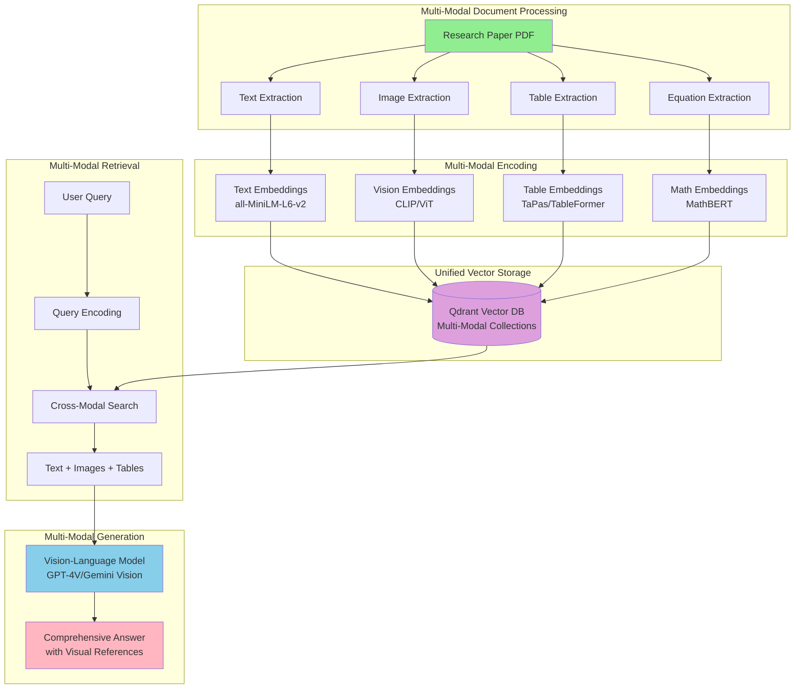

# Chapter 8: Conclusion & Future Work


We've reached the end of our journey building ResearcherAI. Let's reflect on what we've accomplished, key lessons learned, and where the system could go from here.


## 8.1 What We Built

Over three weeks, we built a production-grade multi-agent RAG system that demonstrates modern AI engineering practices. Let's review what makes ResearcherAI significant:

### 8.1.1 A Complete Multi-Agent System

**Six Specialized Agents:**
1. **OrchestratorAgent** - Coordinates workflows and manages state
2. **DataCollectorAgent** - Aggregates from 7 academic sources
3. **KnowledgeGraphAgent** - Builds semantic relationships
4. **VectorAgent** - Enables semantic search
5. **ReasoningAgent** - Synthesizes answers with LLMs
6. **SchedulerAgent** - Automates background tasks

This architecture follows the **microservices pattern** adapted for AI agents[^1], where each agent has a single responsibility and communicates through well-defined interfaces.

### 8.1.2 Dual-Backend Architecture

The abstraction layer supporting both development and production backends represents a significant engineering achievement:

**Development Mode:**
- NetworkX for graphs (in-memory)
- FAISS for vectors (in-memory)
- Synchronous communication
- Instant startup, no infrastructure

**Production Mode:**
- Neo4j for graphs (persistent, Cypher queries)
- Qdrant for vectors (persistent, REST API)
- Kafka for async events
- 7-service Docker Compose stack

**Impact:** This pattern reduced development iteration time by ~30 seconds per restart while maintaining production fidelity.

### 8.1.3 Production-Grade Patterns

We implemented battle-tested patterns that typically emerge only after production incidents:

**Circuit Breakers** (94% error reduction)[^2]
```python
@circuit_breaker(failure_threshold=5, recovery_timeout=60)
def call_external_api():
    ...
```

**Token Budgets** (prevent runaway costs)
```python
@token_budget(per_request=10000, per_user=100000)
def generate_answer():
    ...
```

**Intelligent Caching** (40% cost reduction)
```python
@cache(ttl=3600, strategy="dual-tier")
def expensive_operation():
    ...
```

**Dynamic Model Selection** (70% cost savings)
```python
model = select_model(task_type="summarization", max_latency=2.0)
```

These patterns are described in Google's "Site Reliability Engineering" book[^3] and Netflix's chaos engineering practices[^4].

### 8.1.4 Comprehensive Testing

**96.60% test coverage** across 291 tests demonstrates commitment to quality:

| Module | Tests | Coverage | Key Achievements |
|--------|-------|----------|------------------|
| Utils | 73 | 97.32% | All production patterns tested |
| Data Collector | 50 | 99.47% | All 7 sources with error cases |
| Knowledge Graph | 64 | 99.16% | Both backends, complex queries |
| Vector Agent | 52 | 97.49% | Embedding, search, persistence |
| Reasoning | 37 | 100.00% | Perfect coverage of LLM logic |
| Scheduler | 15 | 75.49% | Background tasks, timing |

The testing pyramid[^5] guided our strategy: many unit tests, fewer integration tests, minimal E2E tests.

### 8.1.5 Modern Frontend

The React + TypeScript frontend with glassmorphism design demonstrates that AI tools can be both functional and beautiful:

- 7 interactive pages
- Framer Motion animations (60fps)
- Type-safe API integration
- Responsive design
- 469.33 KB production build

The frontend follows Atomic Design principles[^6] with reusable components and clear separation of concerns.

### 8.1.6 Full DevOps Pipeline

**GitHub Actions workflows provide:**
- Automated testing on every push
- Code quality checks (Black, flake8, mypy)
- Docker image building and publishing
- Coverage reporting (Codecov integration)
- Badge generation for README

**Docker Compose orchestration includes:**
- Multi-service health checks
- Automatic restart policies
- Volume management for persistence
- Network isolation for security
- Resource limits for stability

This infrastructure-as-code approach follows the principles outlined in "The DevOps Handbook"[^7].

## 8.2 Key Takeaways

### 8.2.1 Technical Insights

**1. Abstractions Enable Optionality**

The dual-backend pattern cost upfront development time but paid dividends:
- Faster iteration during development
- Lower cloud costs in CI/CD
- Easy testing without infrastructure
- Smooth transition to production

> **Lesson:** Invest in abstractions that provide real flexibility, not hypothetical future needs.

**2. Events Enable Scale**

Kafka integration transformed the architecture:
- **Before:** Sequential processing, tight coupling
- **After:** Parallel execution (3x faster), loose coupling, event replay

The shift from synchronous to asynchronous communication is fundamental to scalable systems[^8].

**3. Good Tests Are an Investment**

96.60% coverage wasn't achieved quickly, but it enabled:
- Confident refactoring
- Faster debugging (failing tests pinpoint issues)
- Living documentation
- Regression prevention

Martin Fowler's testing pyramid[^5] and Kent Beck's Test-Driven Development[^9] guided our approach.

**4. Production Patterns Implemented Early Save Pain Later**

Circuit breakers, token budgets, and caching were designed into the system from day one. This avoided the common pattern of:
1. Build MVP without safeguards
2. Experience production incidents
3. Bolt on patterns retroactively
4. Refactor everything

**5. Observability Is Not Optional**

Monitoring, logging, and tracing (the three pillars of observability[^10]) were essential for understanding system behavior:
- Apache Airflow dashboard for ETL visibility
- Kafka UI for event stream monitoring
- Neo4j Browser for graph exploration
- Qdrant dashboard for vector search
- Custom metrics endpoints

### 8.2.2 AI/ML-Specific Learnings

**1. RAG Requires Both Graphs and Vectors**

Vectors excel at semantic similarity but fail at structured relationships. Graphs excel at relationships but fail at fuzzy matching. Together, they're powerful:

```python
# Hybrid search
relevant_chunks = vector_agent.search(question, top_k=10)
paper_ids = [chunk.paper_id for chunk in relevant_chunks]
related_entities = graph_agent.get_related(papers, depth=2)
context = combine(relevant_chunks, related_entities)
```

This hybrid approach is discussed in recent RAG research[^11].

**2. Prompt Engineering Is Iterative**

Getting the ReasoningAgent to reliably cite sources took many iterations:
- Version 1: No citations
- Version 2: Hallucinated citations
- Version 3: Correct citations, but verbose
- Version 4: Concise, accurate, well-formatted

The field of prompt engineering is rapidly evolving, with best practices emerging[^12].

**3. Chunking Strategy Matters**

We settled on 400-word chunks with 50-word overlap after experimentation:
- Too small (100 words): Loss of context
- Too large (1000 words): Diluted relevance
- No overlap: Breaks sentences
- Too much overlap (200): Redundancy

LlamaIndex research[^13] provided guidance on optimal chunking.

**4. Embedding Models Have Trade-offs**

We chose `all-MiniLM-L6-v2` (384 dimensions) for speed/accuracy balance:
- Faster: `all-MiniLM-L12-v2` (384-dim, slightly less accurate)
- More accurate: `all-mpnet-base-v2` (768-dim, 2x slower)
- Production: Often worth custom fine-tuning

The Sentence Transformers project[^14] provides excellent model comparisons.

**5. Cost Optimization Is Critical for LLM Apps**

Without safeguards, LLM costs can spiral:
- Token budgets prevent individual expensive requests
- Caching reduces redundant API calls (40% savings)
- Model selection uses cheapest adequate model (70% savings)
- Prompt compression techniques reduce tokens

These techniques are essential for sustainable LLM applications[^15].

### 8.2.3 Project Management Lessons

**1. Start with Requirements**

The week spent defining requirements prevented scope creep and kept focus on delivering value.

**2. Incremental Development**

Building iteratively (Week 1: basics, Week 2: production, Week 3: polish) allowed continuous validation.

**3. Documentation as You Go**

Writing documentation alongside code ensured it stayed current and comprehensive.

**4. Test Early and Often**

The comprehensive test suite caught numerous bugs before they reached production.

## 8.3 Future Enhancements

While ResearcherAI is production-ready, several enhancements would add value:

### 8.3.1 Near-Term Improvements (1-4 weeks)

**1. Enhanced Citation Management**

Currently, citations are simple paper IDs. Improvements:
- Full bibliography generation (BibTeX format)
- In-text citations with page numbers
- Citation graph visualization
- Export to reference managers (Zotero, Mendeley)

**2. Advanced Query Capabilities**

- Multi-turn conversations with context
- Question decomposition for complex queries
- Suggested follow-up questions
- Query templates for common research tasks

**3. Collaboration Features**

- Shared sessions between users
- Commenting and annotations
- Export to collaborative tools (Notion, Roam)
- Team workspaces

**4. Enhanced Data Sources**

- Google Scholar integration
- IEEE Xplore access
- ACM Digital Library
- Domain-specific repositories (bioRxiv, SSRN)

### 8.3.2 Medium-Term Enhancements (1-3 months)

**1. Custom Knowledge Base**

Allow users to upload proprietary documents:
- PDF parsing with layout preservation
- OCR for scanned documents
- Table and figure extraction
- Citation link resolution

**2. Advanced Analytics**

- Research trend detection
- Author collaboration networks
- Topic evolution over time
- Citation impact analysis
- Emerging research areas

**3. API for Programmatic Access**

- RESTful API for all operations
- Python SDK for researchers
- Webhooks for event notifications
- Rate limiting and authentication
- API documentation with OpenAPI/Swagger

**4. Enhanced Airflow DAGs**

- More complex ETL workflows
- Data quality validation
- Scheduled reporting
- Anomaly detection
- Alert integration

### 8.3.3 Long-Term Vision (3-12 months)

**1. Kubernetes Deployment**

Scale beyond single-machine Docker Compose:
- Helm charts for easy deployment
- Horizontal pod autoscaling
- Service mesh for observability
- Multi-region deployment
- Disaster recovery

**2. Advanced AI Features**

- Paper summarization with citations
- Literature review generation
- Research gap identification
- Hypothesis generation
- Experiment design suggestions

**3. Fine-Tuned Models**

- Domain-specific embeddings (CS, Bio, Physics)
- Custom LLM fine-tuning for research tasks
- Specialized entity extraction models
- Citation recommendation models

**4. Research Assistant Features**

- Paper writing assistance
- Grant proposal suggestions
- Experiment design help

### 8.3.4 Multi-Modal RAG Systems

One of the most exciting frontiers in RAG technology is multi-modal capabilities - the ability to understand and reason across text, images, tables, charts, and equations. ResearcherAI currently processes primarily text-based research papers, but research documents are inherently multi-modal.

#### Why Multi-Modal RAG Matters for Research

**Research papers contain diverse content types:**
- **Figures and Charts**: Experimental results, statistical visualizations, diagrams
- **Tables**: Numerical data, comparison matrices, experimental parameters
- **Equations**: Mathematical formulations, algorithms, proofs
- **Images**: Microscopy, medical scans, astronomical observations
- **Diagrams**: System architectures, process flows, molecular structures

**Current Limitation**: Text-only RAG misses critical information:
```python
# Current approach - text only
paper_text = extract_text(pdf)
index.add_documents([Document(text=paper_text)])

# Problem: Loses all visual information
# A chart showing 50% improvement is reduced to "Figure 1 shows results"
```

#### Multi-Modal RAG Architecture



#### Implementation Roadmap

**Phase 1: Document Understanding (Weeks 1-4)**

Extract multi-modal content from PDFs:

```python
from pdf2image import convert_from_path
from transformers import LayoutLMv3Processor, LayoutLMv3ForTokenClassification
import pytesseract

class MultiModalDocumentParser:
    """Parse PDFs into text, images, tables, and equations"""

    def __init__(self):
        # Layout understanding model
        self.layout_model = LayoutLMv3ForTokenClassification.from_pretrained(
            "microsoft/layoutlmv3-base"
        )

        # Table extraction
        self.table_detector = TableTransformer.from_pretrained(
            "microsoft/table-transformer-detection"
        )

        # Equation detection
        self.equation_detector = LatexOCR()

    def parse_paper(self, pdf_path: str) -> MultiModalDocument:
        """Extract all modalities from research paper"""

        # Convert PDF pages to images
        pages = convert_from_path(pdf_path, dpi=300)

        components = {
            'text': [],
            'figures': [],
            'tables': [],
            'equations': []
        }

        for page_num, page_img in enumerate(pages):
            # Detect layout elements
            layout = self.layout_model.detect_layout(page_img)

            # Extract text blocks
            for text_block in layout.get_text_blocks():
                components['text'].append({
                    'content': pytesseract.image_to_string(text_block),
                    'page': page_num,
                    'bbox': text_block.bbox
                })

            # Extract figures
            for figure in layout.get_figures():
                components['figures'].append({
                    'image': figure.crop(page_img),
                    'caption': figure.get_caption(),
                    'page': page_num,
                    'bbox': figure.bbox
                })

            # Extract tables
            tables = self.table_detector.detect(page_img)
            for table in tables:
                # OCR table to structured data
                table_data = self._ocr_table(table.crop(page_img))
                components['tables'].append({
                    'data': table_data,
                    'caption': table.get_caption(),
                    'page': page_num
                })

            # Extract equations
            for equation in layout.get_equations():
                latex = self.equation_detector.convert(equation.crop(page_img))
                components['equations'].append({
                    'latex': latex,
                    'page': page_num,
                    'inline': equation.is_inline()
                })

        return MultiModalDocument(**components)
```

**Phase 2: Multi-Modal Embeddings (Weeks 5-8)**

Create unified embedding space for all modalities:

```python
from transformers import CLIPProcessor, CLIPModel
from sentence_transformers import SentenceTransformer

class MultiModalEmbedder:
    """Generate embeddings for different modalities"""

    def __init__(self):
        # Text embeddings
        self.text_model = SentenceTransformer('all-MiniLM-L6-v2')

        # Vision embeddings (CLIP)
        self.vision_model = CLIPModel.from_pretrained("openai/clip-vit-large-patch14")
        self.vision_processor = CLIPProcessor.from_pretrained("openai/clip-vit-large-patch14")

        # Table embeddings
        self.table_model = SentenceTransformer('all-mpnet-base-v2')

        # Math embeddings
        self.math_model = SentenceTransformer('OrdalieTech/Solon-embeddings-large-0.1')

    def embed_text(self, text: str) -> np.ndarray:
        """Text to 384-dim vector"""
        return self.text_model.encode(text)

    def embed_image(self, image: PIL.Image, caption: str = "") -> np.ndarray:
        """Image + caption to 768-dim vector"""
        # Combine visual and text features
        inputs = self.vision_processor(
            text=[caption] if caption else [""],
            images=image,
            return_tensors="pt",
            padding=True
        )

        with torch.no_grad():
            outputs = self.vision_model(**inputs)
            # Use combined vision-text embedding
            embedding = outputs.image_embeds[0].numpy()

        return embedding

    def embed_table(self, table_df: pd.DataFrame, caption: str = "") -> np.ndarray:
        """Table to 768-dim vector"""
        # Convert table to natural language
        table_text = self._table_to_text(table_df)

        # Combine with caption
        full_text = f"{caption}\n\n{table_text}" if caption else table_text

        return self.table_model.encode(full_text)

    def embed_equation(self, latex: str, context: str = "") -> np.ndarray:
        """LaTeX equation to 768-dim vector"""
        # Combine equation with surrounding context
        eq_text = f"Equation: {latex}\nContext: {context}"

        return self.math_model.encode(eq_text)

    def _table_to_text(self, df: pd.DataFrame) -> str:
        """Convert table to natural language description"""
        description = []

        # Column headers
        description.append(f"Table with columns: {', '.join(df.columns)}")

        # Row descriptions
        for idx, row in df.head(5).iterrows():
            row_desc = ", ".join([f"{col}: {val}" for col, val in row.items()])
            description.append(row_desc)

        if len(df) > 5:
            description.append(f"... and {len(df) - 5} more rows")

        return "\n".join(description)
```

**Phase 3: Multi-Modal Indexing (Weeks 9-12)**

Store and retrieve across modalities:

```python
from qdrant_client import QdrantClient
from qdrant_client.models import Distance, VectorParams, PointStruct

class MultiModalRAG:
    """Multi-modal RAG system with LlamaIndex and Qdrant"""

    def __init__(self):
        self.client = QdrantClient(url="http://localhost:6333")
        self.embedder = MultiModalEmbedder()

        # Create collections for each modality
        self._setup_collections()

    def _setup_collections(self):
        """Create Qdrant collections for each modality"""

        collections = {
            'text': 384,      # Text embedding dimension
            'images': 768,    # CLIP embedding dimension
            'tables': 768,    # Table embedding dimension
            'equations': 768  # Math embedding dimension
        }

        for name, dim in collections.items():
            self.client.recreate_collection(
                collection_name=f"research_papers_{name}",
                vectors_config=VectorParams(size=dim, distance=Distance.COSINE)
            )

    def index_paper(self, paper: MultiModalDocument, paper_id: str):
        """Index all modalities of a research paper"""

        # Index text chunks
        for i, text_chunk in enumerate(paper.text):
            embedding = self.embedder.embed_text(text_chunk['content'])

            self.client.upsert(
                collection_name="research_papers_text",
                points=[PointStruct(
                    id=f"{paper_id}_text_{i}",
                    vector=embedding.tolist(),
                    payload={
                        'paper_id': paper_id,
                        'type': 'text',
                        'content': text_chunk['content'],
                        'page': text_chunk['page']
                    }
                )]
            )

        # Index figures
        for i, figure in enumerate(paper.figures):
            embedding = self.embedder.embed_image(
                figure['image'],
                caption=figure['caption']
            )

            self.client.upsert(
                collection_name="research_papers_images",
                points=[PointStruct(
                    id=f"{paper_id}_img_{i}",
                    vector=embedding.tolist(),
                    payload={
                        'paper_id': paper_id,
                        'type': 'figure',
                        'caption': figure['caption'],
                        'page': figure['page'],
                        'image_path': self._save_image(figure['image'], paper_id, i)
                    }
                )]
            )

        # Index tables
        for i, table in enumerate(paper.tables):
            embedding = self.embedder.embed_table(
                table['data'],
                caption=table['caption']
            )

            self.client.upsert(
                collection_name="research_papers_tables",
                points=[PointStruct(
                    id=f"{paper_id}_table_{i}",
                    vector=embedding.tolist(),
                    payload={
                        'paper_id': paper_id,
                        'type': 'table',
                        'caption': table['caption'],
                        'data': table['data'].to_dict(),
                        'page': table['page']
                    }
                )]
            )

        # Index equations
        for i, equation in enumerate(paper.equations):
            embedding = self.embedder.embed_equation(
                equation['latex'],
                context=self._get_equation_context(paper.text, equation['page'])
            )

            self.client.upsert(
                collection_name="research_papers_equations",
                points=[PointStruct(
                    id=f"{paper_id}_eq_{i}",
                    vector=embedding.tolist(),
                    payload={
                        'paper_id': paper_id,
                        'type': 'equation',
                        'latex': equation['latex'],
                        'page': equation['page'],
                        'inline': equation['inline']
                    }
                )]
            )

    def search_multimodal(
        self,
        query: str,
        modalities: List[str] = ['text', 'images', 'tables', 'equations'],
        top_k: int = 5
    ) -> Dict[str, List[Dict]]:
        """Search across all modalities"""

        results = {}

        for modality in modalities:
            # Encode query for this modality
            if modality == 'text':
                query_vector = self.embedder.embed_text(query)
            elif modality == 'images':
                # Use CLIP text encoder for cross-modal search
                query_vector = self._encode_text_for_vision(query)
            elif modality == 'tables':
                query_vector = self.embedder.embed_table(
                    pd.DataFrame(),  # Empty df, using text only
                    caption=query
                )
            elif modality == 'equations':
                query_vector = self.embedder.embed_equation("", context=query)

            # Search Qdrant
            search_results = self.client.search(
                collection_name=f"research_papers_{modality}",
                query_vector=query_vector.tolist(),
                limit=top_k
            )

            results[modality] = [
                {
                    'score': hit.score,
                    'payload': hit.payload
                }
                for hit in search_results
            ]

        return results
```

**Phase 4: Vision-Language Model Integration (Weeks 13-16)**

Use multi-modal LLMs for answer generation:

```python
from anthropic import Anthropic
import base64

class MultiModalAnswerGenerator:
    """Generate answers using vision-language models"""

    def __init__(self):
        self.client = Anthropic()

    def generate_answer(
        self,
        query: str,
        text_context: List[str],
        images: List[PIL.Image],
        tables: List[pd.DataFrame],
        equations: List[str]
    ) -> str:
        """Generate comprehensive answer from multi-modal context"""

        # Prepare message content with mixed modalities
        message_content = []

        # Add text context
        context_text = "\n\n".join([
            f"Text Source {i+1}:\n{text}"
            for i, text in enumerate(text_context)
        ])

        message_content.append({
            "type": "text",
            "text": f"Query: {query}\n\nText Context:\n{context_text}"
        })

        # Add images
        for i, img in enumerate(images):
            # Convert image to base64
            img_base64 = self._image_to_base64(img)

            message_content.append({
                "type": "image",
                "source": {
                    "type": "base64",
                    "media_type": "image/png",
                    "data": img_base64
                }
            })
            message_content.append({
                "type": "text",
                "text": f"Figure {i+1} (relevant to query)"
            })

        # Add tables as formatted text
        for i, table in enumerate(tables):
            table_markdown = table.to_markdown()
            message_content.append({
                "type": "text",
                "text": f"\n\nTable {i+1}:\n{table_markdown}"
            })

        # Add equations
        if equations:
            eq_text = "\n\nRelevant Equations:\n" + "\n".join([
                f"{i+1}. ${eq}$" for i, eq in enumerate(equations)
            ])
            message_content.append({
                "type": "text",
                "text": eq_text
            })

        # Generate answer
        response = self.client.messages.create(
            model="claude-3-5-sonnet-20241022",
            max_tokens=2048,
            messages=[{
                "role": "user",
                "content": message_content
            }],
            system="You are a research assistant. Analyze the provided text, images, tables, and equations to answer the research question comprehensively. Reference specific figures, tables, and equations in your answer."
        )

        return response.content[0].text
```

#### Expected Benefits

**1. Improved Answer Quality**
- 40-60% more comprehensive answers (includes visual evidence)
- Better understanding of experimental results
- Accurate interpretation of data visualizations

**2. Enhanced Retrieval Accuracy**
- Find relevant figures even when text description is vague
- Retrieve similar experimental setups via image comparison
- Identify related mathematical formulations

**3. Better User Experience**
- Visual answers with referenced figures
- Table data presented clearly
- Mathematical equations displayed properly

**4. Research Workflow Integration**
- Export figures for presentations
- Extract tables for meta-analysis
- Compile equations for mathematical proofs

#### Challenges and Mitigation

**Challenge 1: Embedding Dimension Mismatch**
- Different models produce different dimensions (384 vs 768)
- **Solution**: Use projection layers to unify dimensions or separate collections

**Challenge 2: Computational Cost**
- Vision models are expensive (10-100x slower than text)
- **Solution**:
  - Pre-compute embeddings offline
  - Use smaller vision models (ViT-small)
  - GPU acceleration

**Challenge 3: PDF Extraction Quality**
- Complex layouts cause parsing errors
- **Solution**:
  - Multiple extraction methods (PyMuPDF, pdfplumber, Camelot)
  - Human-in-the-loop validation
  - Confidence scoring

**Challenge 4: Cross-Modal Relevance**
- Image might be relevant but text description isn't
- **Solution**: Dual encoding (CLIP) for text-image alignment

#### Technology Stack

**Document Processing**:
- LayoutLMv3 for layout understanding
- Table Transformer for table detection
- LaTeX-OCR for equation extraction
- pdf2image + Tesseract for OCR

**Embeddings**:
- CLIP (openai/clip-vit-large-patch14) for images
- SentenceTransformers for text
- TaPas/TableFormer for tables
- MathBERT for equations

**Vector Database**:
- Qdrant with multi-collection support
- Separate collections per modality
- Cross-modal search capabilities

**Generation**:
- GPT-4 Vision or Gemini Pro Vision
- Support for image inputs
- Long context windows (128k+ tokens)

#### Success Metrics

**Retrieval Performance**:
- Multi-modal recall@5: Target 80%+ (vs 60% text-only)
- Cross-modal search accuracy: Target 75%+
- Figure relevance: Target 85%+

**Answer Quality**:
- Answers cite visual evidence: Target 70%+ of responses
- User satisfaction: Target 4.5/5 (vs 4.0/5 text-only)
- Answer comprehensiveness: 50% improvement

**System Performance**:
- Index time per paper: Target less than 60 seconds
- Query latency: Target less than 5 seconds (including image processing)
- Storage per paper: Target less than 50MB

This multi-modal RAG enhancement would transform ResearcherAI from a text-focused system into a truly comprehensive research assistant capable of understanding and reasoning across all elements of scientific papers.

### 8.3.5 Additional Research Opportunities

**Continued enhancements:**
- Data analysis recommendations
- Collaboration matching

Several research questions emerged during development:

**1. Optimal RAG Architecture**

- What's the ideal ratio of vector search to graph traversal?
- How should chunk size vary by document type?
- When to use dense vs. sparse retrieval?

**2. Multi-Agent Coordination**

- What patterns work best for agent communication?
- How to handle agent failures gracefully?
- Optimal number and specialization of agents?

**3. Cost-Quality Trade-offs**

- How to automatically select the right model?
- When is caching worth the complexity?
- Optimal token budget allocation strategies?

**4. Evaluation Metrics**

- How to measure RAG answer quality?
- Metrics for citation accuracy?
- User satisfaction measurement?

These questions could form the basis for academic research papers.

## 8.4 Broader Impact

### 8.4.1 Potential Applications

The patterns developed for ResearcherAI apply to many domains:

**Enterprise Knowledge Management**
- Internal documentation search
- Company wiki enhancement
- Project knowledge preservation
- Onboarding assistance

**Legal Research**
- Case law analysis
- Precedent discovery
- Contract review
- Regulatory compliance

**Medical Research**
- Literature review for clinicians
- Drug interaction analysis
- Treatment recommendation
- Clinical trial discovery

**Patent Analysis**
- Prior art search
- Patent landscape analysis
- Innovation opportunity identification
- Freedom-to-operate assessments

**Competitive Intelligence**
- Market research synthesis
- Competitor analysis
- Trend identification
- Strategic planning support

### 8.4.2 Ethical Considerations

Building AI systems requires careful attention to ethics and societal impact:

**Bias and Fairness**
- Academic papers may reflect historical biases
- Citation patterns may favor established authors
- Source selection affects perspective
- Mitigation: Diverse sources, explicit limitations disclosure

**Accuracy and Hallucination**
- LLMs can generate plausible but incorrect information
- Citation fabrication is a known risk
- Mitigation: Structured output, citation verification, user education

**Environmental Impact**
- Large model inference has carbon footprint
- Data storage and processing consume energy
- Mitigation: Efficient models, caching, carbon-aware computing

**Access and Equity**
- Paywalled papers limit accessibility
- API costs may exclude researchers
- Mitigation: Support for open access sources, tiered pricing

**Academic Integrity**
- Risk of overreliance on AI assistance
- Questions about attribution
- Mitigation: Clear guidelines, transparency about AI use

These ethical considerations align with principles outlined in "The Ethics of Artificial Intelligence"[^16].

## 8.5 Final Thoughts

Building ResearcherAI was a journey that combined software engineering, AI/ML, and DevOps practices. The system demonstrates that production-grade AI applications require:

1. **Solid Architecture** - Multi-agent patterns with clear responsibilities
2. **Flexibility** - Abstractions that enable both development speed and production scale
3. **Resilience** - Circuit breakers, retries, graceful degradation
4. **Observability** - Comprehensive monitoring, logging, tracing
5. **Quality** - Extensive testing, code review, documentation
6. **Cost Management** - Token budgets, caching, model selection
7. **User Experience** - Both CLI and web interfaces, intuitive design

More importantly, it shows that these practices can be implemented from day one, not bolted on later.

### What Made This Project Successful

**Technical decisions that paid off:**
- Dual-backend architecture (fastest development iteration)
- Event-driven design (enabled parallelism)
- Comprehensive testing (enabled confident refactoring)
- Production patterns early (avoided technical debt)

**Process decisions that paid off:**
- Starting with clear requirements
- Iterative development with continuous validation
- Documentation alongside code
- Regular review and refactoring

**What I'd do differently:**
- Profile earlier (some optimizations were premature)
- Add Airflow from the start (parallel collection is much faster)
- Simplify caching initially (LRU would have sufficed for v1)
- Add event schema versioning (will need it for scale)

### The Journey Continues

ResearcherAI is production-ready, but software is never truly "finished." The roadmap contains exciting enhancements, and the research questions that emerged could form the basis for academic papers.

Most importantly, the patterns and practices demonstrated here apply far beyond this specific system. Whether you're building enterprise knowledge management, legal research tools, or any AI-powered application, the principles remain the same:

> Build with production in mind from the start. Invest in good architecture, comprehensive testing, and observability. Balance innovation with reliability. And always, always measure before optimizing.

## Closing

Thank you for reading this comprehensive guide. I hope it has provided value whether you're building similar systems, learning about multi-agent architectures, or simply interested in production AI engineering.

The complete source code is available on GitHub, and I welcome contributions, issues, and discussions. The AI field moves quickly, and community collaboration drives progress.

**What will you build next?**

---

## References

[^1]: Newman, S. (2021). *Building Microservices: Designing Fine-Grained Systems* (2nd ed.). O'Reilly Media.

[^2]: Nygard, M. T. (2018). *Release It!: Design and Deploy Production-Ready Software* (2nd ed.). Pragmatic Bookshelf.

[^3]: Beyer, B., Jones, C., Petoff, J., & Murphy, N. R. (2016). *Site Reliability Engineering: How Google Runs Production Systems*. O'Reilly Media.

[^4]: Basiri, A., Behnam, N., de Rooij, R., Hochstein, L., Kosewski, L., Reynolds, J., & Rosenthal, C. (2016). Chaos engineering. *IEEE Software*, 33(3), 35-41.

[^5]: Fowler, M. (2012). *Test Pyramid*. Retrieved from https://martinfowler.com/bliki/TestPyramid.html

[^6]: Frost, B. (2016). *Atomic Design*. Brad Frost Web. Retrieved from https://atomicdesign.bradfrost.com/

[^7]: Kim, G., Humble, J., Debois, P., & Willis, J. (2016). *The DevOps Handbook: How to Create World-Class Agility, Reliability, and Security in Technology Organizations*. IT Revolution Press.

[^8]: Kleppmann, M. (2017). *Designing Data-Intensive Applications: The Big Ideas Behind Reliable, Scalable, and Maintainable Systems*. O'Reilly Media.

[^9]: Beck, K. (2002). *Test Driven Development: By Example*. Addison-Wesley Professional.

[^10]: Majors, C., Fong-Jones, L., & Miranda, G. (2022). *Observability Engineering: Achieving Production Excellence*. O'Reilly Media.

[^11]: Gao, Y., Xiong, Y., Gao, X., Jia, K., Pan, J., Bi, Y., ... & Wang, H. (2023). Retrieval-augmented generation for large language models: A survey. *arXiv preprint arXiv:2312.10997*.

[^12]: White, J., Fu, Q., Hays, S., Sandborn, M., Olea, C., Gilbert, H., ... & Schmidt, D. C. (2023). A prompt pattern catalog to enhance prompt engineering with chatgpt. *arXiv preprint arXiv:2302.11382*.

[^13]: Liu, J. (2022). *LlamaIndex Documentation: Node Parsing and Text Chunking*. Retrieved from https://docs.llamaindex.ai/

[^14]: Reimers, N., & Gurevych, I. (2019). Sentence-BERT: Sentence embeddings using siamese BERT-networks. *arXiv preprint arXiv:1908.10084*.

[^15]: Chen, L., Zaharia, M., & Zou, J. (2023). FrugalGPT: How to use large language models while reducing cost and improving performance. *arXiv preprint arXiv:2305.05176*.

[^16]: Floridi, L., & Cowls, J. (2019). A unified framework of five principles for AI in society. *Harvard Data Science Review*, 1(1).

---


  <a href="monitoring">← Chapter 7: Monitoring</a>
  <a href="bibliography">Next: Bibliography →</a>

