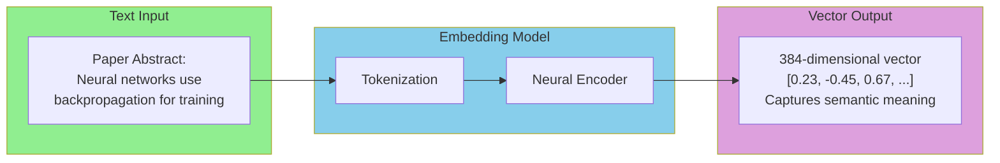
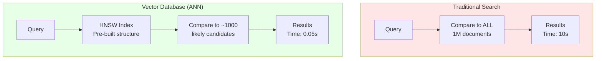
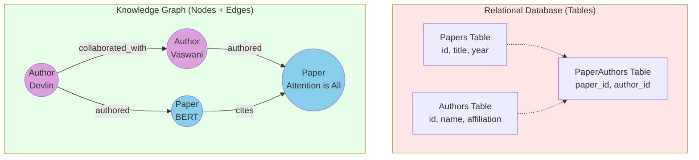
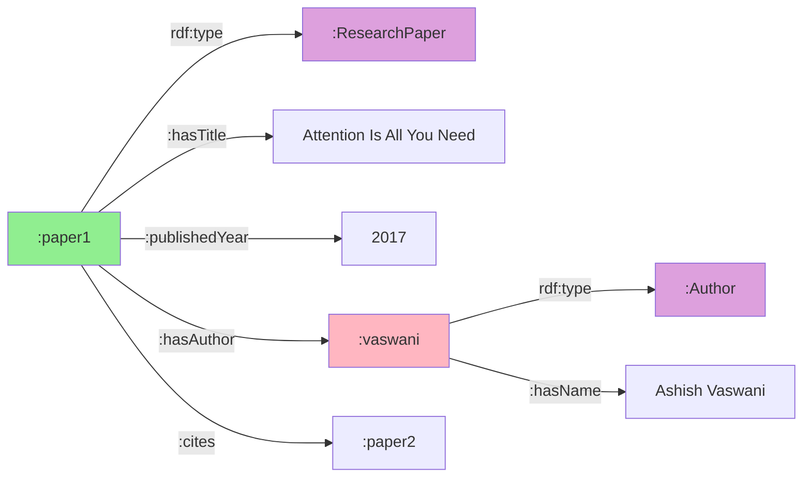
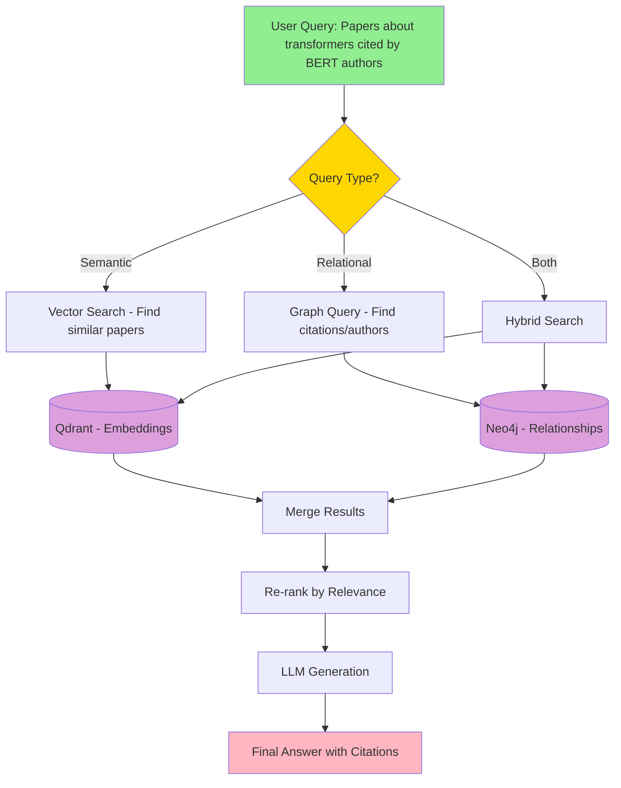
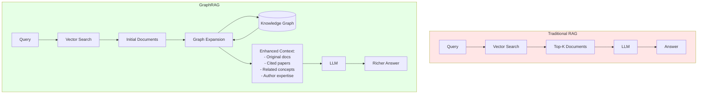
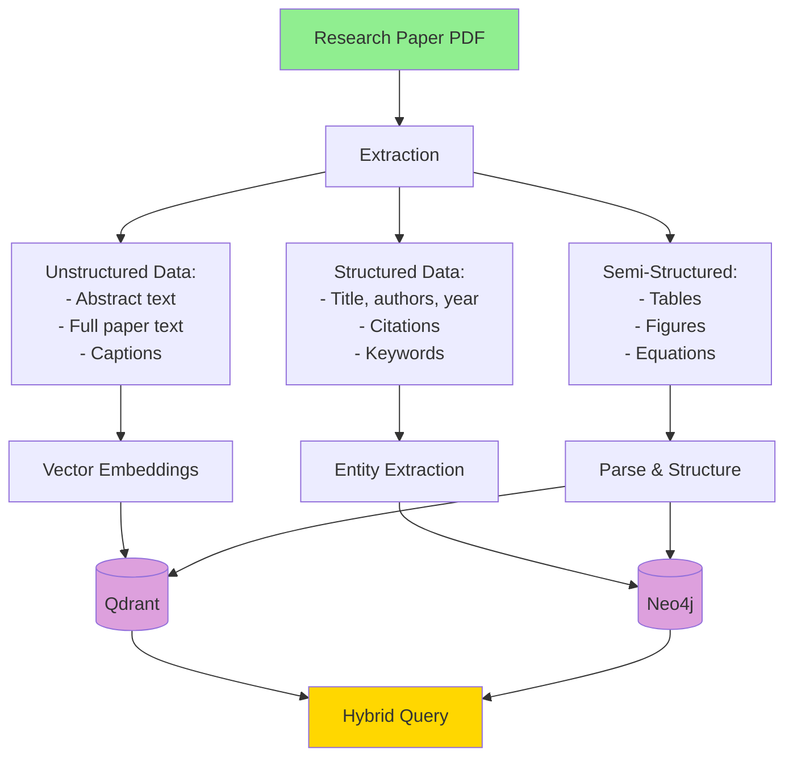

# Chapter 3: Data Foundations - Vector Databases, Knowledge Graphs, and GraphRAG

## Introduction

Before building intelligent agents, we must understand how to store and retrieve information effectively. This chapter takes you from basic keyword search to advanced GraphRAG, explaining *why* each technology exists and *when* to use it.

:::tip For Web Developers
This chapter is like learning about databases in web development:
- Keyword search = Simple `WHERE name LIKE '%query%'`
- Vector search = Semantic similarity (no exact matches needed)
- Knowledge graphs = Relational databases on steroids
- GraphRAG = Combining the best of all worlds
:::

## The Problem: Traditional Search Doesn't Work for Research

### Keyword Search Limitations

Imagine searching for papers about "neural networks for language understanding":

**Keyword Search**:
```python
def keyword_search(query: str, documents: List[str]) -> List[str]:
    """Traditional keyword matching"""
    results = []
    keywords = query.lower().split()

    for doc in documents:
        doc_lower = doc.lower()
        if all(keyword in doc_lower for keyword in keywords):
            results.append(doc)

    return results

# Search papers
query = "neural networks for language understanding"
results = keyword_search(query, papers)
```

**Problems**:

1. **Synonym Problem**: Misses "deep learning" when searching "neural networks"
2. **Word Order**: "language understanding with neural networks" won't match
3. **Context Ignored**: Can't understand "transformers" means attention mechanism
4. **No Semantics**: "bank" (financial) vs "bank" (river) treated identically

**Real Example**:
```python
# User searches: "attention mechanisms in NLP"
# Misses papers that say:
# - "self-attention for natural language processing"
# - "transformer architecture for text understanding"
# - "query-key-value attention for language models"
# All mean the same thing but use different words!
```

### What We Actually Need

For research, we need:
- **Semantic understanding**: "neural network" = "deep learning" = "artificial network"
- **Context awareness**: Understand concepts, not just words
- **Relationship mapping**: How papers, authors, and concepts connect
- **Reasoning capabilities**: "If A cites B, and B discusses C, then A likely relates to C"

This requires two complementary technologies:
1. **Vector Databases** (semantic similarity)
2. **Knowledge Graphs** (relationship reasoning)

Let's understand each from scratch.

---

## Part 1: Vector Databases and Semantic Search

### From Words to Vectors

**Core Idea**: Represent text as numbers that capture meaning.

#### The Intuition

```python
# Imagine each word has a position in "meaning space"
# Similar meanings = close positions

king    = [0.8, 0.3, 0.1]  # Royalty, male, power
queen   = [0.8, 0.9, 0.1]  # Royalty, female, power
man     = [0.2, 0.3, 0.0]  # Common, male, neutral
woman   = [0.2, 0.9, 0.0]  # Common, female, neutral

# Amazing property:
# king - man + woman ≈ queen
# [0.8, 0.3, 0.1] - [0.2, 0.3, 0.0] + [0.2, 0.9, 0.0] = [0.8, 0.9, 0.1]
```

This is **word embeddings** - representing words as dense vectors that capture semantic relationships.

### How Embeddings Work



#### Creating Embeddings

```python
from sentence_transformers import SentenceTransformer

# Load embedding model (runs locally!)
model = SentenceTransformer('all-MiniLM-L6-v2')

# Create embeddings
texts = [
    "Neural networks for image classification",
    "Deep learning in computer vision",
    "Convolutional networks for image recognition"
]

embeddings = model.encode(texts)
print(embeddings.shape)  # (3, 384) - 3 texts, 384 dimensions each
```

#### Measuring Similarity

```python
import numpy as np

def cosine_similarity(vec1, vec2):
    """Measure how similar two vectors are (0=different, 1=identical)"""
    return np.dot(vec1, vec2) / (np.linalg.norm(vec1) * np.linalg.norm(vec2))

# Compare texts
query = "neural nets for images"
query_embedding = model.encode(query)

for i, text in enumerate(texts):
    similarity = cosine_similarity(query_embedding, embeddings[i])
    print(f"Similarity to '{text}': {similarity:.3f}")

# Output:
# Similarity to 'Neural networks for image classification': 0.782
# Similarity to 'Deep learning in computer vision': 0.691
# Similarity to 'Convolutional networks for image recognition': 0.745
```

**Key Insight**: Even though exact words differ, semantic similarity is captured!

### Vector Databases: Scaling Semantic Search

Comparing embeddings one-by-one doesn't scale. For 1 million papers:
- Comparing query to all papers: **1 million comparisons**
- At 0.01ms per comparison: **10 seconds per query** ❌

**Solution**: Vector databases with approximate nearest neighbor (ANN) search.



### Development: FAISS (In-Memory)

**FAISS** (Facebook AI Similarity Search) - perfect for development and testing.

```python
import faiss
import numpy as np

class FAISSVectorStore:
    """Development vector database using FAISS"""

    def __init__(self, dimension: int = 384):
        self.dimension = dimension
        # Create FAISS index (L2 distance)
        self.index = faiss.IndexFlatL2(dimension)
        self.documents = []  # Store original documents

    def add_documents(self, texts: List[str], embeddings: np.ndarray):
        """Add documents to index"""
        # FAISS requires float32
        embeddings_f32 = embeddings.astype('float32')

        # Add to index
        self.index.add(embeddings_f32)

        # Store documents
        self.documents.extend(texts)

        print(f"✓ Indexed {len(texts)} documents (total: {self.index.ntotal})")

    def search(self, query_embedding: np.ndarray, top_k: int = 5) -> List[tuple]:
        """Search for similar documents"""
        # Ensure float32
        query_f32 = query_embedding.astype('float32').reshape(1, -1)

        # Search (returns distances and indices)
        distances, indices = self.index.search(query_f32, top_k)

        # Convert L2 distances to similarity scores (0-1)
        similarities = 1 / (1 + distances[0])

        # Return documents with scores
        results = [
            (self.documents[idx], float(sim))
            for idx, sim in zip(indices[0], similarities)
            if idx < len(self.documents)
        ]

        return results

# Usage
vector_store = FAISSVectorStore(dimension=384)

# Index papers
papers = [
    "Attention is all you need - introduces transformer architecture",
    "BERT: Pre-training of deep bidirectional transformers",
    "GPT-3: Language models are few-shot learners",
    "ResNet: Deep residual learning for image recognition",
    "YOLO: Real-time object detection"
]

embeddings = model.encode(papers)
vector_store.add_documents(papers, embeddings)

# Search
query = "transformer models for NLP"
query_emb = model.encode(query)
results = vector_store.search(query_emb, top_k=3)

for doc, score in results:
    print(f"Score: {score:.3f} - {doc}")
```

**Output**:
```
Score: 0.856 - Attention is all you need - introduces transformer architecture
Score: 0.792 - BERT: Pre-training of deep bidirectional transformers
Score: 0.743 - GPT-3: Language models are few-shot learners
```

Notice: **ResNet and YOLO** (computer vision) are correctly excluded even though they're valid papers!

### Production: Qdrant (Persistent, Scalable)

**Qdrant** - production-grade vector database with persistence and APIs.

```python
from qdrant_client import QdrantClient
from qdrant_client.models import Distance, VectorParams, PointStruct

class QdrantVectorStore:
    """Production vector database using Qdrant"""

    def __init__(
        self,
        collection_name: str = "research_papers",
        url: str = "http://localhost:6333"
    ):
        self.client = QdrantClient(url=url)
        self.collection_name = collection_name
        self.dimension = 384

        # Create collection if not exists
        self._create_collection()

    def _create_collection(self):
        """Create Qdrant collection"""
        try:
            self.client.get_collection(self.collection_name)
            print(f"✓ Collection '{self.collection_name}' exists")
        except:
            self.client.create_collection(
                collection_name=self.collection_name,
                vectors_config=VectorParams(
                    size=self.dimension,
                    distance=Distance.COSINE  # Cosine similarity
                )
            )
            print(f"✓ Created collection '{self.collection_name}'")

    def add_documents(
        self,
        texts: List[str],
        embeddings: np.ndarray,
        metadata: List[Dict] = None
    ):
        """Add documents with metadata"""
        points = []

        for idx, (text, embedding) in enumerate(zip(texts, embeddings)):
            point = PointStruct(
                id=idx,
                vector=embedding.tolist(),
                payload={
                    "text": text,
                    **(metadata[idx] if metadata else {})
                }
            )
            points.append(point)

        # Batch upload
        self.client.upsert(
            collection_name=self.collection_name,
            points=points
        )

        print(f"✓ Indexed {len(points)} documents")

    def search(
        self,
        query_embedding: np.ndarray,
        top_k: int = 5,
        filters: Dict = None
    ) -> List[tuple]:
        """Search with optional metadata filters"""
        results = self.client.search(
            collection_name=self.collection_name,
            query_vector=query_embedding.tolist(),
            limit=top_k,
            query_filter=filters  # Can filter by metadata!
        )

        return [
            (result.payload["text"], result.score)
            for result in results
        ]

# Usage
qdrant_store = QdrantVectorStore(collection_name="papers")

# Index with metadata
metadata = [
    {"year": 2017, "citations": 50000, "venue": "NeurIPS"},
    {"year": 2018, "citations": 30000, "venue": "NAACL"},
    {"year": 2020, "citations": 15000, "venue": "NeurIPS"},
    {"year": 2015, "citations": 40000, "venue": "CVPR"},
    {"year": 2016, "citations": 25000, "venue": "CVPR"}
]

qdrant_store.add_documents(papers, embeddings, metadata)

# Search with filters
query_emb = model.encode("transformer models for NLP")
results = qdrant_store.search(
    query_emb,
    top_k=5,
    filters={"must": [{"key": "year", "range": {"gte": 2017}}]}  # Papers after 2017
)

for doc, score in results:
    print(f"Score: {score:.3f} - {doc}")
```

### Vector Search: Dev vs Prod Comparison

| Feature | FAISS (Dev) | Qdrant (Prod) |
|---------|-------------|---------------|
| **Storage** | In-memory only | Persistent to disk |
| **Startup** | Instant | ~2 seconds |
| **Scalability** | Single machine | Distributed cluster |
| **Metadata** | Manual tracking | Built-in filtering |
| **APIs** | Python only | REST + gRPC + Python |
| **Persistence** | Save/load manually | Automatic |
| **Best for** | Development, testing, prototyping | Production, millions of vectors |

:::tip When to Use Each
- **Development**: Use FAISS - instant startup, no infrastructure
- **Production**: Use Qdrant - persistence, scalability, filtering
- **ResearcherAI**: Uses both with abstraction layer!
:::

---

## Part 2: Knowledge Graphs and Structured Reasoning

### Why Vector Search Isn't Enough

Vector search excels at finding **similar content**, but fails at:

**1. Relationship Questions**
```
Query: "Which papers cite both attention mechanisms and BERT?"
Vector search: ❌ Can't traverse citations
Knowledge graph: ✅ MATCH (p)-[:CITES]->(a), (p)-[:CITES]->(b)
```

**2. Multi-Hop Reasoning**
```
Query: "Find papers by authors who collaborated with Yoshua Bengio"
Vector search: ❌ Can't follow author → author connections
Knowledge graph: ✅ Path traversal over collaboration edges
```

**3. Structured Queries**
```
Query: "Papers published in 2020 that cite papers from before 2015"
Vector search: ❌ No temporal reasoning
Knowledge graph: ✅ Filter by year property + traverse citations
```

### From Tables to Graphs



**Key Differences**:

**Tables** (Relational):
- Fixed schema
- Join operations expensive
- Hard to add new relationship types
- Optimized for transactional queries

**Graphs** (Network):
- Flexible schema
- Traversals are natural
- Easy to add new edges
- Optimized for relationship queries

### Knowledge Graph Basics

**Components**:

1. **Nodes** (Entities): Papers, Authors, Concepts, Institutions
2. **Edges** (Relationships): CITES, AUTHORED_BY, DISCUSSES, AFFILIATED_WITH
3. **Properties**: title, year, citations_count, etc.

**Example Graph**:
```python
# Nodes
Paper1 = {
    "id": "paper_1",
    "type": "Paper",
    "title": "Attention is All You Need",
    "year": 2017,
    "citations": 50000
}

Author1 = {
    "id": "author_1",
    "type": "Author",
    "name": "Ashish Vaswani"
}

Concept1 = {
    "id": "concept_1",
    "type": "Concept",
    "name": "Transformer"
}

# Edges
edges = [
    (Author1, "AUTHORED", Paper1),
    (Paper1, "INTRODUCES", Concept1),
    (Paper2, "CITES", Paper1),
    (Paper2, "USES", Concept1)
]
```

### Development: NetworkX (In-Memory)

**NetworkX** - Python library for graph operations, perfect for development.

```python
import networkx as nx
from typing import Dict, List

class NetworkXKnowledgeGraph:
    """Development knowledge graph using NetworkX"""

    def __init__(self):
        self.graph = nx.MultiDiGraph()  # Directed graph with multiple edges

    def add_paper(self, paper_id: str, title: str, year: int, abstract: str = ""):
        """Add paper node"""
        self.graph.add_node(
            paper_id,
            type="Paper",
            title=title,
            year=year,
            abstract=abstract
        )

    def add_author(self, author_id: str, name: str):
        """Add author node"""
        self.graph.add_node(
            author_id,
            type="Author",
            name=name
        )

    def add_concept(self, concept_id: str, name: str):
        """Add concept node"""
        self.graph.add_node(
            concept_id,
            type="Concept",
            name=name
        )

    def add_authored(self, author_id: str, paper_id: str):
        """Add AUTHORED relationship"""
        self.graph.add_edge(author_id, paper_id, type="AUTHORED")

    def add_citation(self, citing_paper: str, cited_paper: str):
        """Add CITES relationship"""
        self.graph.add_edge(citing_paper, cited_paper, type="CITES")

    def add_discusses(self, paper_id: str, concept_id: str):
        """Add DISCUSSES relationship"""
        self.graph.add_edge(paper_id, concept_id, type="DISCUSSES")

    def find_papers_by_author(self, author_name: str) -> List[Dict]:
        """Find all papers by an author"""
        papers = []

        for node, data in self.graph.nodes(data=True):
            if data.get("type") == "Author" and data.get("name") == author_name:
                # Find papers this author authored
                for neighbor in self.graph.successors(node):
                    if self.graph.nodes[neighbor].get("type") == "Paper":
                        papers.append({
                            "id": neighbor,
                            **self.graph.nodes[neighbor]
                        })

        return papers

    def find_citing_papers(self, paper_id: str) -> List[Dict]:
        """Find papers that cite a given paper"""
        citing = []

        for pred in self.graph.predecessors(paper_id):
            edge_data = self.graph.get_edge_data(pred, paper_id)
            if any(e.get("type") == "CITES" for e in edge_data.values()):
                if self.graph.nodes[pred].get("type") == "Paper":
                    citing.append({
                        "id": pred,
                        **self.graph.nodes[pred]
                    })

        return citing

    def find_related_concepts(self, paper_id: str) -> List[str]:
        """Find concepts discussed in a paper"""
        concepts = []

        for neighbor in self.graph.successors(paper_id):
            if self.graph.nodes[neighbor].get("type") == "Concept":
                concepts.append(self.graph.nodes[neighbor].get("name"))

        return concepts

    def find_collaboration_network(self, author_name: str, depth: int = 2) -> List[str]:
        """Find authors who collaborated (shared papers)"""
        collaborators = set()

        # Find author node
        author_node = None
        for node, data in self.graph.nodes(data=True):
            if data.get("type") == "Author" and data.get("name") == author_name:
                author_node = node
                break

        if not author_node:
            return []

        # Find papers by this author
        papers = [n for n in self.graph.successors(author_node)
                 if self.graph.nodes[n].get("type") == "Paper"]

        # Find co-authors
        for paper in papers:
            for pred in self.graph.predecessors(paper):
                if self.graph.nodes[pred].get("type") == "Author" and pred != author_node:
                    collaborators.add(self.graph.nodes[pred].get("name"))

        return list(collaborators)

# Usage
kg = NetworkXKnowledgeGraph()

# Add nodes
kg.add_paper("paper_1", "Attention is All You Need", 2017)
kg.add_paper("paper_2", "BERT: Pre-training Transformers", 2018)
kg.add_paper("paper_3", "GPT-3: Language Models", 2020)

kg.add_author("author_1", "Ashish Vaswani")
kg.add_author("author_2", "Jacob Devlin")
kg.add_author("author_3", "Tom Brown")

kg.add_concept("concept_1", "Transformer")
kg.add_concept("concept_2", "Attention Mechanism")
kg.add_concept("concept_3", "Pre-training")

# Add relationships
kg.add_authored("author_1", "paper_1")
kg.add_authored("author_2", "paper_2")
kg.add_authored("author_3", "paper_3")

kg.add_discusses("paper_1", "concept_1")
kg.add_discusses("paper_1", "concept_2")
kg.add_discusses("paper_2", "concept_1")
kg.add_discusses("paper_2", "concept_3")

kg.add_citation("paper_2", "paper_1")  # BERT cites Attention
kg.add_citation("paper_3", "paper_1")  # GPT-3 cites Attention
kg.add_citation("paper_3", "paper_2")  # GPT-3 cites BERT

# Query the graph
print("Papers by Ashish Vaswani:")
papers = kg.find_papers_by_author("Ashish Vaswani")
for paper in papers:
    print(f"  - {paper['title']}")

print("\nPapers citing 'Attention is All You Need':")
citing = kg.find_citing_papers("paper_1")
for paper in citing:
    print(f"  - {paper['title']}")

print("\nConcepts in paper_1:")
concepts = kg.find_related_concepts("paper_1")
print(f"  {', '.join(concepts)}")

print("\nCollaborators of Jacob Devlin:")
collabs = kg.find_collaboration_network("Jacob Devlin")
print(f"  {', '.join(collabs)}")
```

**Output**:
```
Papers by Ashish Vaswani:
  - Attention is All You Need

Papers citing 'Attention is All You Need':
  - BERT: Pre-training Transformers
  - GPT-3: Language Models

Concepts in paper_1:
  Transformer, Attention Mechanism

Collaborators of Jacob Devlin:
  Ashish Vaswani
```

### Production: Neo4j (Persistent, Cypher)

**Neo4j** - enterprise-grade graph database with powerful query language (Cypher).

```python
from neo4j import GraphDatabase

class Neo4jKnowledgeGraph:
    """Production knowledge graph using Neo4j"""

    def __init__(self, uri: str = "bolt://localhost:7687", user: str = "neo4j", password: str = "password"):
        self.driver = GraphDatabase.driver(uri, auth=(user, password))

    def close(self):
        self.driver.close()

    def add_paper(self, paper_id: str, title: str, year: int, abstract: str = ""):
        """Add paper node"""
        with self.driver.session() as session:
            session.run("""
                MERGE (p:Paper {id: $paper_id})
                SET p.title = $title, p.year = $year, p.abstract = $abstract
            """, paper_id=paper_id, title=title, year=year, abstract=abstract)

    def add_author(self, author_id: str, name: str):
        """Add author node"""
        with self.driver.session() as session:
            session.run("""
                MERGE (a:Author {id: $author_id})
                SET a.name = $name
            """, author_id=author_id, name=name)

    def add_concept(self, concept_id: str, name: str):
        """Add concept node"""
        with self.driver.session() as session:
            session.run("""
                MERGE (c:Concept {id: $concept_id})
                SET c.name = $name
            """, concept_id=concept_id, name=name)

    def add_authored(self, author_id: str, paper_id: str):
        """Add AUTHORED relationship"""
        with self.driver.session() as session:
            session.run("""
                MATCH (a:Author {id: $author_id})
                MATCH (p:Paper {id: $paper_id})
                MERGE (a)-[:AUTHORED]->(p)
            """, author_id=author_id, paper_id=paper_id)

    def add_citation(self, citing_paper: str, cited_paper: str):
        """Add CITES relationship"""
        with self.driver.session() as session:
            session.run("""
                MATCH (citing:Paper {id: $citing_paper})
                MATCH (cited:Paper {id: $cited_paper})
                MERGE (citing)-[:CITES]->(cited)
            """, citing_paper=citing_paper, cited_paper=cited_paper)

    def add_discusses(self, paper_id: str, concept_id: str):
        """Add DISCUSSES relationship"""
        with self.driver.session() as session:
            session.run("""
                MATCH (p:Paper {id: $paper_id})
                MATCH (c:Concept {id: $concept_id})
                MERGE (p)-[:DISCUSSES]->(c)
            """, paper_id=paper_id, concept_id=concept_id)

    def find_papers_by_author(self, author_name: str) -> List[Dict]:
        """Find all papers by an author"""
        with self.driver.session() as session:
            result = session.run("""
                MATCH (a:Author {name: $name})-[:AUTHORED]->(p:Paper)
                RETURN p.id as id, p.title as title, p.year as year
            """, name=author_name)
            return [dict(record) for record in result]

    def find_citing_papers(self, paper_id: str) -> List[Dict]:
        """Find papers that cite a given paper"""
        with self.driver.session() as session:
            result = session.run("""
                MATCH (citing:Paper)-[:CITES]->(cited:Paper {id: $paper_id})
                RETURN citing.id as id, citing.title as title, citing.year as year
            """, paper_id=paper_id)
            return [dict(record) for record in result]

    def find_related_concepts(self, paper_id: str) -> List[str]:
        """Find concepts discussed in a paper"""
        with self.driver.session() as session:
            result = session.run("""
                MATCH (p:Paper {id: $paper_id})-[:DISCUSSES]->(c:Concept)
                RETURN c.name as concept
            """, paper_id=paper_id)
            return [record["concept"] for record in result]

    def find_collaboration_network(self, author_name: str) -> List[str]:
        """Find authors who collaborated (shared papers)"""
        with self.driver.session() as session:
            result = session.run("""
                MATCH (a1:Author {name: $name})-[:AUTHORED]->(p:Paper)<-[:AUTHORED]-(a2:Author)
                WHERE a1 <> a2
                RETURN DISTINCT a2.name as collaborator
            """, name=author_name)
            return [record["collaborator"] for record in result]

    def find_citation_chain(self, start_paper: str, end_paper: str, max_depth: int = 5):
        """Find citation path between two papers"""
        with self.driver.session() as session:
            result = session.run("""
                MATCH path = shortestPath(
                    (start:Paper {id: $start})-[:CITES*1..{max_depth}]->(end:Paper {id: $end})
                )
                RETURN [node in nodes(path) | node.title] as path
            """.replace("{max_depth}", str(max_depth)), start=start_paper, end=end_paper)

            records = list(result)
            return records[0]["path"] if records else []

# Usage
neo4j_kg = Neo4jKnowledgeGraph()

# Add same data as NetworkX example
neo4j_kg.add_paper("paper_1", "Attention is All You Need", 2017)
neo4j_kg.add_paper("paper_2", "BERT: Pre-training Transformers", 2018)
neo4j_kg.add_author("author_1", "Ashish Vaswani")
neo4j_kg.add_authored("author_1", "paper_1")
neo4j_kg.add_citation("paper_2", "paper_1")

# Advanced query: Citation chain
chain = neo4j_kg.find_citation_chain("paper_3", "paper_1")
print(f"Citation path: {' -> '.join(chain)}")

neo4j_kg.close()
```

### Cypher Query Language

Cypher is Neo4j's declarative query language - incredibly powerful:

```cypher
// Find papers published after 2018 that cite papers with >10000 citations
MATCH (recent:Paper)-[:CITES]->(influential:Paper)
WHERE recent.year > 2018 AND influential.citations > 10000
RETURN recent.title, influential.title, influential.citations
ORDER BY influential.citations DESC

// Find "research communities" - groups of authors who frequently collaborate
MATCH (a1:Author)-[:AUTHORED]->(:Paper)<-[:AUTHORED]-(a2:Author)
WHERE a1.name < a2.name
WITH a1, a2, count(*) as collaborations
WHERE collaborations > 3
RETURN a1.name, a2.name, collaborations
ORDER BY collaborations DESC

// Find trending concepts (discussed in papers with growing citations)
MATCH (p:Paper)-[:DISCUSSES]->(c:Concept)
WHERE p.year >= 2020
WITH c, avg(p.citations) as avg_citations, count(p) as paper_count
WHERE paper_count > 5
RETURN c.name, avg_citations, paper_count
ORDER BY avg_citations DESC
LIMIT 10
```

### Knowledge Graph: Dev vs Prod Comparison

| Feature | NetworkX (Dev) | Neo4j (Prod) |
|---------|----------------|--------------|
| **Storage** | In-memory only | Persistent to disk |
| **Query Language** | Python code | Cypher (declarative) |
| **Scalability** | 1000s of nodes | Billions of nodes |
| **Performance** | Slow for large graphs | Optimized indexes |
| **Transactions** | No | ACID transactions |
| **Clustering** | No | Multi-node clusters |
| **Best for** | Development, algorithms | Production, complex queries |

:::tip When to Use Each
- **Development**: NetworkX - no setup, great for prototyping
- **Production**: Neo4j - performance, Cypher queries, persistence
- **ResearcherAI**: Abstracts both behind unified interface!
:::

### Semantic Web: Ontologies, RDF, and SPARQL

So far we've discussed **property graphs** (Neo4j, NetworkX). There's another powerful approach: **semantic web technologies** using **RDF** and **ontologies**.

#### What Are Ontologies?

Think of an ontology as a **formal schema for your knowledge**:

**Web Developer Analogy**:
```javascript
// TypeScript interface = Ontology
interface Person {
  name: string;
  worksFor: Organization;
  knows: Person[];
}

interface Organization {
  name: string;
  foundedDate: Date;
}
```

An **ontology** defines:
- **Classes** (Person, Paper, Author, Concept)
- **Properties** (name, authored, cites, discusses)
- **Relationships** (Author → authored → Paper)
- **Constraints** (a Paper must have at least one Author)

#### RDF: Resource Description Framework

RDF represents knowledge as **triples**:

```
Subject  Predicate  Object
```

Every statement is a triple (like a sentence):

```turtle
# Turtle syntax (RDF format)
:paper1  rdf:type  :ResearchPaper .
:paper1  :hasTitle  "Attention Is All You Need" .
:paper1  :publishedYear  2017 .
:paper1  :hasAuthor  :vaswani .
:paper1  :cites  :paper2 .

:vaswani  rdf:type  :Author .
:vaswani  :hasName  "Ashish Vaswani" .
```

**Web Developer Analogy**:
```javascript
// JSON = Property Graph
{
  "id": "paper1",
  "title": "Attention Is All You Need",
  "year": 2017,
  "authors": ["vaswani"]
}

// RDF Triples = Semantic Web
["paper1", "type", "ResearchPaper"]
["paper1", "hasTitle", "Attention Is All You Need"]
["paper1", "publishedYear", 2017]
["paper1", "hasAuthor", "vaswani"]
```

#### RDF Triple Visualization



#### Development: RDFLib (Python)

For development, use **RDFLib** - a pure Python library:

```python
from rdflib import Graph, Namespace, Literal, URIRef
from rdflib.namespace import RDF, RDFS

class RDFKnowledgeGraph:
    """Development RDF knowledge graph using RDFLib"""

    def __init__(self):
        self.graph = Graph()

        # Define custom namespace for our ontology
        self.ns = Namespace("http://researcherai.org/ontology#")
        self.graph.bind("research", self.ns)

    def add_paper(
        self,
        paper_id: str,
        title: str,
        year: int,
        abstract: str = ""
    ):
        """Add a research paper to the graph"""
        paper_uri = URIRef(f"http://researcherai.org/papers/{paper_id}")

        # Add triples
        self.graph.add((paper_uri, RDF.type, self.ns.ResearchPaper))
        self.graph.add((paper_uri, self.ns.hasTitle, Literal(title)))
        self.graph.add((paper_uri, self.ns.publishedYear, Literal(year)))

        if abstract:
            self.graph.add((paper_uri, self.ns.hasAbstract, Literal(abstract)))

    def add_author(self, author_id: str, name: str, affiliation: str = ""):
        """Add an author to the graph"""
        author_uri = URIRef(f"http://researcherai.org/authors/{author_id}")

        self.graph.add((author_uri, RDF.type, self.ns.Author))
        self.graph.add((author_uri, self.ns.hasName, Literal(name)))

        if affiliation:
            self.graph.add((author_uri, self.ns.affiliation, Literal(affiliation)))

    def link_author_to_paper(self, author_id: str, paper_id: str):
        """Create authorship relationship"""
        author_uri = URIRef(f"http://researcherai.org/authors/{author_id}")
        paper_uri = URIRef(f"http://researcherai.org/papers/{paper_id}")

        self.graph.add((paper_uri, self.ns.hasAuthor, author_uri))
        self.graph.add((author_uri, self.ns.authored, paper_uri))

    def add_citation(self, citing_paper_id: str, cited_paper_id: str):
        """Add citation relationship"""
        citing_uri = URIRef(f"http://researcherai.org/papers/{citing_paper_id}")
        cited_uri = URIRef(f"http://researcherai.org/papers/{cited_paper_id}")

        self.graph.add((citing_uri, self.ns.cites, cited_uri))
        self.graph.add((cited_uri, self.ns.citedBy, citing_uri))

    def query_sparql(self, sparql_query: str):
        """Execute SPARQL query"""
        return self.graph.query(sparql_query)

    def export_turtle(self, filename: str):
        """Export graph to Turtle format"""
        self.graph.serialize(destination=filename, format='turtle')

    def load_turtle(self, filename: str):
        """Load graph from Turtle format"""
        self.graph.parse(filename, format='turtle')


# Example usage
rdf_kg = RDFKnowledgeGraph()

# Add papers
rdf_kg.add_paper(
    "paper1",
    "Attention Is All You Need",
    2017,
    "The dominant sequence transduction models..."
)

rdf_kg.add_paper(
    "paper2",
    "BERT: Pre-training of Deep Bidirectional Transformers",
    2019,
    "We introduce BERT..."
)

# Add authors
rdf_kg.add_author("vaswani", "Ashish Vaswani", "Google Brain")
rdf_kg.add_author("devlin", "Jacob Devlin", "Google AI")

# Link relationships
rdf_kg.link_author_to_paper("vaswani", "paper1")
rdf_kg.link_author_to_paper("devlin", "paper2")
rdf_kg.add_citation("paper2", "paper1")  # BERT cites Attention paper

# Export to file
rdf_kg.export_turtle("research_graph.ttl")
```

#### SPARQL: Query Language for RDF

**SPARQL** is to RDF what **Cypher** is to Neo4j (or SQL to relational databases):

```sparql
# Find all papers by a specific author
PREFIX research: <http://researcherai.org/ontology#>

SELECT ?paper ?title ?year
WHERE {
    ?author research:hasName "Ashish Vaswani" .
    ?author research:authored ?paper .
    ?paper research:hasTitle ?title .
    ?paper research:publishedYear ?year .
}
ORDER BY ?year
```

**Python Example**:

```python
sparql_query = """
PREFIX research: <http://researcherai.org/ontology#>

SELECT ?citing_title ?cited_title
WHERE {
    ?citing_paper research:cites ?cited_paper .
    ?citing_paper research:hasTitle ?citing_title .
    ?cited_paper research:hasTitle ?cited_title .
}
"""

results = rdf_kg.query_sparql(sparql_query)
for row in results:
    print(f"{row.citing_title} cites {row.cited_title}")
```

#### More SPARQL Examples

```sparql
# Find authors who collaborated (co-authored papers)
PREFIX research: <http://researcherai.org/ontology#>

SELECT ?author1_name ?author2_name ?paper_title
WHERE {
    ?paper research:hasAuthor ?author1 .
    ?paper research:hasAuthor ?author2 .
    ?paper research:hasTitle ?paper_title .
    ?author1 research:hasName ?author1_name .
    ?author2 research:hasName ?author2_name .
    FILTER(?author1 != ?author2)
}

# Find highly cited papers (cited by many others)
SELECT ?title (COUNT(?citing) as ?citation_count)
WHERE {
    ?paper research:hasTitle ?title .
    ?citing research:cites ?paper .
}
GROUP BY ?title
HAVING (COUNT(?citing) > 100)
ORDER BY DESC(?citation_count)

# Find papers published after 2018 in a specific domain
SELECT ?title ?year
WHERE {
    ?paper research:hasTitle ?title .
    ?paper research:publishedYear ?year .
    ?paper research:discusses ?concept .
    ?concept research:hasName "transformers" .
    FILTER(?year > 2018)
}
```

#### Production: Apache Jena & SPARQL Endpoint

For production, use **Apache Jena Fuseki** - a SPARQL server:

```python
from SPARQLWrapper import SPARQLWrapper, JSON
import requests

class JenaKnowledgeGraph:
    """Production RDF knowledge graph using Apache Jena Fuseki"""

    def __init__(
        self,
        endpoint_url: str = "http://localhost:3030/research",
        update_endpoint: str = "http://localhost:3030/research/update"
    ):
        self.endpoint_url = endpoint_url
        self.update_endpoint = update_endpoint
        self.sparql = SPARQLWrapper(endpoint_url)

    def add_triples(self, triples_turtle: str):
        """Add RDF triples to the graph"""
        # Use SPARQL UPDATE to insert data
        update_query = f"""
        PREFIX research: <http://researcherai.org/ontology#>

        INSERT DATA {{
            {triples_turtle}
        }}
        """

        response = requests.post(
            self.update_endpoint,
            data={"update": update_query},
            headers={"Content-Type": "application/x-www-form-urlencoded"}
        )
        return response.status_code == 200

    def add_paper(self, paper_id: str, title: str, year: int):
        """Add a research paper"""
        triples = f"""
        @prefix research: <http://researcherai.org/ontology#> .
        @prefix rdf: <http://www.w3.org/1999/02/22-rdf-syntax-ns#> .

        <http://researcherai.org/papers/{paper_id}>
            rdf:type research:ResearchPaper ;
            research:hasTitle "{title}" ;
            research:publishedYear {year} .
        """
        return self.add_triples(triples)

    def query(self, sparql_query: str) -> list:
        """Execute SPARQL SELECT query"""
        self.sparql.setQuery(sparql_query)
        self.sparql.setReturnFormat(JSON)

        results = self.sparql.query().convert()
        return results["results"]["bindings"]

    def find_papers_by_author(self, author_name: str) -> list:
        """Find all papers by an author"""
        query = f"""
        PREFIX research: <http://researcherai.org/ontology#>

        SELECT ?paper ?title ?year
        WHERE {{
            ?author research:hasName "{author_name}" .
            ?author research:authored ?paper .
            ?paper research:hasTitle ?title .
            ?paper research:publishedYear ?year .
        }}
        ORDER BY DESC(?year)
        """
        return self.query(query)

    def find_citation_chain(self, paper_id: str, depth: int = 2) -> list:
        """Find papers that cite this paper (transitive)"""
        query = f"""
        PREFIX research: <http://researcherai.org/ontology#>

        SELECT ?citing_paper ?title ?distance
        WHERE {{
            <http://researcherai.org/papers/{paper_id}>
                ^research:cites{{1,{depth}}} ?citing_paper .
            ?citing_paper research:hasTitle ?title .

            BIND(
                COUNT(?intermediate) as ?distance
            )
        }}
        """
        return self.query(query)


# Example usage with Fuseki
jena_kg = JenaKnowledgeGraph(
    endpoint_url="http://localhost:3030/research/sparql",
    update_endpoint="http://localhost:3030/research/update"
)

# Add paper
jena_kg.add_paper(
    "attention2017",
    "Attention Is All You Need",
    2017
)

# Query
results = jena_kg.find_papers_by_author("Ashish Vaswani")
for result in results:
    print(f"{result['title']['value']} ({result['year']['value']})")
```

#### OWL: Web Ontology Language - The Power of Reasoning

**OWL** (Web Ontology Language) extends RDF with **reasoning capabilities**. It's the difference between storing facts and **deriving new knowledge** from those facts.

**Web Developer Analogy**:
```javascript
// RDF = Data storage
const data = {
  "Vaswani": { type: "Author", authored: ["paper1"] }
}

// OWL = Data storage + Logic rules
const data = { ... }
const rules = {
  // If someone authored a paper, they are a researcher
  "Author who authored something → Researcher"
}
// Reasoner can INFER: "Vaswani is a Researcher" (even if not explicitly stated)
```

#### Why OWL Matters: Automatic Inference

**Without OWL** (just RDF):
```turtle
:vaswani :authored :paper1 .
# To know Vaswani is a researcher, you must explicitly state it
```

**With OWL** (RDF + reasoning):
```turtle
# Define rule: anyone who authored something is a researcher
:authored rdfs:domain :Researcher .

# Just state the fact
:vaswani :authored :paper1 .

# OWL reasoner AUTOMATICALLY infers:
:vaswani rdf:type :Researcher .  # Derived, not stated!
```

#### OWL Ontology Definition

```turtle
@prefix owl: <http://www.w3.org/2002/07/owl#> .
@prefix rdfs: <http://www.w3.org/2000/01/rdf-schema#> .
@prefix xsd: <http://www.w3.org/2001/XMLSchema#> .
@prefix research: <http://researcherai.org/ontology#> .

# Define classes
research:ResearchPaper rdf:type owl:Class .
research:Author rdf:type owl:Class .
research:Researcher rdf:type owl:Class .
research:Concept rdf:type owl:Class .
research:InfluentialPaper rdf:type owl:Class .

# Define class hierarchy
research:Author rdfs:subClassOf research:Researcher .
# All Authors are Researchers (but not all Researchers are Authors)

# Define properties
research:hasAuthor rdf:type owl:ObjectProperty ;
    rdfs:domain research:ResearchPaper ;
    rdfs:range research:Author .

research:cites rdf:type owl:ObjectProperty ;
    rdfs:domain research:ResearchPaper ;
    rdfs:range research:ResearchPaper .

research:citedBy rdf:type owl:ObjectProperty ;
    owl:inverseOf research:cites .  # Automatic inverse!

research:hasTitle rdf:type owl:DatatypeProperty ;
    rdfs:domain research:ResearchPaper ;
    rdfs:range xsd:string .

research:publishedYear rdf:type owl:DatatypeProperty ;
    rdfs:domain research:ResearchPaper ;
    rdfs:range xsd:integer .

research:citationCount rdf:type owl:DatatypeProperty ;
    rdfs:domain research:ResearchPaper ;
    rdfs:range xsd:integer .

# Define constraints
research:ResearchPaper rdfs:subClassOf [
    rdf:type owl:Restriction ;
    owl:onProperty research:hasAuthor ;
    owl:minCardinality "1"^^xsd:nonNegativeInteger
] .  # A paper must have at least one author

# Define derived class (automatic classification!)
research:InfluentialPaper owl:equivalentClass [
    rdf:type owl:Restriction ;
    owl:onProperty research:citationCount ;
    owl:someValuesFrom [
        rdf:type rdfs:Datatype ;
        owl:onDatatype xsd:integer ;
        owl:withRestrictions ([ xsd:minInclusive 100 ])
    ]
] .  # Papers with 100+ citations are automatically "InfluentialPaper"

# Property characteristics
research:collaboratesWith rdf:type owl:SymmetricProperty .
# If A collaborates with B, then B collaborates with A

research:cites rdf:type owl:TransitiveProperty .
# If A cites B, and B cites C, then A transitively cites C
```

#### Development: Owlready2 with Reasoning

For development, use **owlready2** - a Python library with built-in reasoner:

```python
from owlready2 import *
import tempfile

class OWLKnowledgeGraph:
    """Development OWL ontology with reasoning"""

    def __init__(self, ontology_iri="http://researcherai.org/ontology"):
        self.onto = get_ontology(ontology_iri)

        with self.onto:
            # Define classes
            class ResearchPaper(Thing):
                pass

            class Author(Thing):
                pass

            class Researcher(Thing):
                pass

            class Concept(Thing):
                pass

            class InfluentialPaper(ResearchPaper):
                pass

            # Define properties
            class hasAuthor(ObjectProperty):
                domain = [ResearchPaper]
                range = [Author]

            class authored(ObjectProperty):
                domain = [Author]
                range = [ResearchPaper]
                inverse_property = hasAuthor

            class cites(ObjectProperty, TransitiveProperty):
                domain = [ResearchPaper]
                range = [ResearchPaper]

            class citedBy(ObjectProperty):
                inverse_property = cites

            class collaboratesWith(ObjectProperty, SymmetricProperty):
                domain = [Author]
                range = [Author]

            class hasTitle(DataProperty, FunctionalProperty):
                domain = [ResearchPaper]
                range = [str]

            class publishedYear(DataProperty, FunctionalProperty):
                domain = [ResearchPaper]
                range = [int]

            class citationCount(DataProperty):
                domain = [ResearchPaper]
                range = [int]

            # Define rules
            class AuthorRule(Author >> Researcher):
                """All authors are researchers"""
                pass

            # Define automatic classification
            class InfluentialPaperRule(ResearchPaper):
                equivalent_to = [
                    ResearchPaper & citationCount.some(int >= 100)
                ]

        self.ResearchPaper = self.onto.ResearchPaper
        self.Author = self.onto.Author
        self.hasAuthor = self.onto.hasAuthor
        self.cites = self.onto.cites
        self.hasTitle = self.onto.hasTitle
        self.publishedYear = self.onto.publishedYear
        self.citationCount = self.onto.citationCount

    def add_paper(self, paper_id: str, title: str, year: int, citations: int = 0):
        """Add a research paper"""
        paper = self.ResearchPaper(paper_id)
        paper.hasTitle = [title]
        paper.publishedYear = [year]
        paper.citationCount = [citations]
        return paper

    def add_author(self, author_id: str, name: str):
        """Add an author"""
        author = self.Author(author_id)
        author.label = [name]
        return author

    def link_author_to_paper(self, author, paper):
        """Create authorship relationship"""
        author.authored.append(paper)
        # Inverse relationship is automatic!

    def add_citation(self, citing_paper, cited_paper):
        """Add citation relationship"""
        citing_paper.cites.append(cited_paper)
        # citedBy is automatic (inverse property)!

    def run_reasoner(self):
        """Run OWL reasoner to infer new facts"""
        print("Running reasoner...")
        with self.onto:
            sync_reasoner(debug=False)
        print("Reasoning complete!")

    def find_influential_papers(self):
        """Find papers automatically classified as influential"""
        return list(self.onto.InfluentialPaper.instances())

    def find_all_researchers(self):
        """Find all researchers (including inferred ones)"""
        return list(self.onto.Researcher.instances())

    def save(self, filename: str):
        """Save ontology to file"""
        self.onto.save(file=filename, format="rdfxml")

    def load(self, filename: str):
        """Load ontology from file"""
        self.onto = get_ontology(filename).load()


# Example usage with reasoning
owl_kg = OWLKnowledgeGraph()

# Add papers
paper1 = owl_kg.add_paper("attention2017", "Attention Is All You Need", 2017, 15000)
paper2 = owl_kg.add_paper("bert2019", "BERT", 2019, 8000)
paper3 = owl_kg.add_paper("transformer_xl", "Transformer-XL", 2019, 500)

# Add authors
vaswani = owl_kg.add_author("vaswani", "Ashish Vaswani")
devlin = owl_kg.add_author("devlin", "Jacob Devlin")

# Link relationships
owl_kg.link_author_to_paper(vaswani, paper1)
owl_kg.link_author_to_paper(devlin, paper2)

# Add citations
owl_kg.add_citation(paper2, paper1)  # BERT cites Attention
owl_kg.add_citation(paper3, paper1)  # Transformer-XL cites Attention

print("Before reasoning:")
print(f"Influential papers: {len(owl_kg.find_influential_papers())}")
print(f"Researchers: {len(owl_kg.find_all_researchers())}")

# Run reasoner
owl_kg.run_reasoner()

print("\nAfter reasoning:")
# Papers with 100+ citations are automatically classified as InfluentialPaper
influential = owl_kg.find_influential_papers()
print(f"Influential papers: {[p.hasTitle[0] for p in influential]}")

# Authors are automatically inferred to be Researchers
researchers = owl_kg.find_all_researchers()
print(f"Researchers: {[r.label[0] for r in researchers]}")

# Check inverse properties
print(f"\nVaswani authored: {[p.hasTitle[0] for p in vaswani.authored]}")
print(f"Paper1 has authors: {[a.label[0] for a in paper1.hasAuthor]}")
# Both work! Inverse is automatic.

# Check citedBy (inverse of cites)
print(f"\nPaper1 is cited by: {[p.hasTitle[0] for p in paper1.citedBy]}")
# Automatic from cites relationship!
```

#### OWL Reasoning Examples

**1. Class Hierarchy Inference**:
```python
# Define hierarchy
with owl_kg.onto:
    class Author(Thing):
        pass

    class PhDStudent(Author):
        pass

    class Professor(Author):
        pass

    # All Authors are Researchers
    class AuthorIsResearcher(Author >> Researcher):
        pass

# Create instance
phd_student = owl_kg.onto.PhDStudent("alice")

# Before reasoning
print(phd_student.is_a)  # [PhDStudent]

# Run reasoner
sync_reasoner()

# After reasoning
print(phd_student.is_a)  # [PhDStudent, Author, Researcher]
# Automatically inferred Alice is an Author and Researcher!
```

**2. Property Propagation**:
```python
# Define transitive property
class influences(ObjectProperty, TransitiveProperty):
    pass

# State facts
paper_a = ResearchPaper("paper_a")
paper_b = ResearchPaper("paper_b")
paper_c = ResearchPaper("paper_c")

paper_a.influences = [paper_b]  # A influences B
paper_b.influences = [paper_c]  # B influences C

# Run reasoner
sync_reasoner()

# Reasoner infers: A influences C (transitively)
print(paper_c in paper_a.influences)  # True!
```

**3. Automatic Classification**:
```python
# Define rule: Papers with many authors are "Collaborative"
with owl_kg.onto:
    class CollaborativePaper(ResearchPaper):
        equivalent_to = [
            ResearchPaper & hasAuthor.min(5)  # 5+ authors
        ]

# Add paper with 6 authors
paper = ResearchPaper("multi_author_paper")
for i in range(6):
    author = Author(f"author_{i}")
    paper.hasAuthor.append(author)

# Run reasoner
sync_reasoner()

# Paper is automatically classified as CollaborativePaper!
print(CollaborativePaper in paper.is_a)  # True!
```

#### Production: Apache Jena with OWL Reasoner

For production, use **Apache Jena** with built-in OWL reasoners:

```python
from rdflib import Graph, Namespace
from rdflib.plugins.sparql import prepareQuery

class JenaOWLKnowledgeGraph:
    """Production OWL knowledge graph with Jena reasoner"""

    def __init__(self, fuseki_url: str = "http://localhost:3030/research"):
        self.fuseki_url = fuseki_url
        self.graph = Graph()
        self.ns = Namespace("http://researcherai.org/ontology#")

        # Load ontology schema
        self.load_ontology()

    def load_ontology(self):
        """Load OWL ontology definitions"""
        ontology_ttl = """
        @prefix owl: <http://www.w3.org/2002/07/owl#> .
        @prefix rdfs: <http://www.w3.org/2000/01/rdf-schema#> .
        @prefix research: <http://researcherai.org/ontology#> .

        research:Author rdfs:subClassOf research:Researcher .
        research:authored rdfs:domain research:Author .
        research:cites rdf:type owl:TransitiveProperty .
        research:citedBy owl:inverseOf research:cites .
        """
        self.graph.parse(data=ontology_ttl, format="turtle")

    def query_with_reasoning(self, sparql_query: str):
        """Execute SPARQL with reasoning enabled"""
        # Jena Fuseki can enable reasoner via endpoint config
        # Example: http://localhost:3030/research_reasoned/sparql
        results = self.graph.query(sparql_query)
        return list(results)


# Configure Jena Fuseki with OWL reasoner
fuseki_config = """
<#service> rdf:type fuseki:Service ;
    fuseki:name "research" ;
    fuseki:serviceQuery "sparql" ;
    fuseki:dataset <#dataset> .

<#dataset> rdf:type ja:DatasetTxnMem ;
    ja:defaultGraph <#model_inf> .

<#model_inf> rdf:type ja:InfModel ;
    ja:reasoner [
        ja:reasonerURL <http://jena.hpl.hp.com/2003/OWLFBRuleReasoner>
    ] ;
    ja:baseModel <#model_base> .

<#model_base> rdf:type ja:MemoryModel .
"""
```

#### OWL Profiles: Which to Use?

OWL has different **profiles** (subsets) for different use cases:

| Profile | Complexity | Reasoning | Use Case |
|---------|------------|-----------|----------|
| **OWL Full** | Maximum expressivity | Undecidable | Research, experimental |
| **OWL DL** | Description Logic | Complete & decidable | General purpose |
| **OWL Lite** | Basic class hierarchy | Simple & fast | Simple taxonomies |
| **OWL EL** | Existential quantification | Polynomial time | Large ontologies (medical) |
| **OWL QL** | Query-oriented | Log-space | Database integration |
| **OWL RL** | Rule-based | Polynomial time | Business rules |

**For ResearcherAI**: Use **OWL DL** or **OWL RL** - balance of expressivity and performance.

#### When to Use OWL vs Just RDF

**Use OWL when you need**:

1. **Automatic classification**
   - Classify papers as "influential" based on citation count
   - Identify "interdisciplinary" papers based on concept diversity

2. **Inference from rules**
   - Infer co-authors from paper authorship
   - Derive expertise areas from publication history

3. **Consistency checking**
   - Ensure papers have at least one author
   - Validate that publication years are reasonable

4. **Property inheritance**
   - Symmetric properties (collaboration)
   - Transitive properties (influence, citation chains)
   - Inverse properties (cites ↔ citedBy)

**Use just RDF when**:

1. **Simple data storage** - no complex reasoning needed
2. **Performance critical** - reasoning is computationally expensive
3. **Schema is stable** - don't need automatic classification
4. **Explicit is better** - want to state all facts explicitly

#### OWL Reasoning: Dev vs Prod Comparison

| Feature | Owlready2 (Dev) | Apache Jena (Prod) |
|---------|-----------------|-------------------|
| **Language** | Python | Java (Python client) |
| **Reasoners** | HermiT, Pellet | Jena, Pellet, HermiT |
| **Performance** | Slower (Python) | Faster (Java) |
| **Scalability** | Small ontologies | Large ontologies |
| **Ease of Use** | Very easy (Pythonic) | More complex setup |
| **Integration** | Great for scripts | Enterprise integration |
| **Best for** | Development, prototyping | Production, large scale |

**Example Use Case for ResearcherAI**:

```python
# Use OWL to automatically identify "rising stars" (researchers)
# Rule: A rising star is someone who:
# - Authored papers in the last 3 years
# - Has papers cited > 50 times
# - Collaborates with established researchers

with owl_kg.onto:
    class EstablishedResearcher(Researcher):
        equivalent_to = [
            Researcher & authored.some(
                ResearchPaper & citationCount.some(int >= 500)
            )
        ]

    class RisingStar(Researcher):
        equivalent_to = [
            Researcher &
            authored.some(
                ResearchPaper &
                publishedYear.some(int >= 2021) &
                citationCount.some(int >= 50)
            ) &
            collaboratesWith.some(EstablishedResearcher)
        ]

# Run reasoner
sync_reasoner()

# Automatically finds rising stars!
rising_stars = list(owl_kg.onto.RisingStar.instances())
print(f"Rising stars: {[r.label[0] for r in rising_stars]}")
```

:::tip OWL Summary
- **OWL** = RDF + reasoning/inference capabilities
- **Use for**: Automatic classification, rule-based inference, consistency checking
- **Dev**: owlready2 (easy Python integration)
- **Prod**: Apache Jena (performance, scalability)
- **ResearcherAI**: Could use OWL for researcher classification, paper categorization
:::

:::warning OWL Performance
OWL reasoning can be **computationally expensive**. For large knowledge graphs (millions of triples), reasoning can take minutes to hours. Consider:
- Using simpler OWL profiles (EL, QL, RL)
- Pre-computing inferences offline
- Using incremental reasoning
- Caching reasoner results
:::

#### RDF vs Property Graphs: When to Use Each

| Feature | RDF (Jena/RDFLib) | Property Graphs (Neo4j) |
|---------|-------------------|-------------------------|
| **Data Model** | Triples (subject-predicate-object) | Nodes with properties + labeled edges |
| **Schema** | Ontology (OWL) | Schema optional |
| **Standards** | W3C standards (RDF, OWL, SPARQL) | No universal standard |
| **Query Language** | SPARQL | Cypher |
| **Reasoning** | Built-in inferencing (OWL reasoners) | No built-in reasoning |
| **Flexibility** | Extremely flexible, schema evolution | More rigid structure |
| **Performance** | Slower for graph traversal | Optimized for graph queries |
| **Use Case** | Scientific data, linked data, ontologies | Social networks, recommendations |
| **Learning Curve** | Steeper (ontologies, W3C specs) | Gentler (more intuitive) |

**Web Developer Analogy**:
- **RDF** = XML/JSON-LD with strict schemas (TypeScript with interfaces)
- **Property Graphs** = NoSQL document store with relationships (MongoDB + relationships)

#### When to Use RDF:

1. **Need formal ontologies** - scientific domains, medical data
2. **Data integration** - combining data from multiple sources
3. **Reasoning/inference** - derive new facts from existing ones
4. **Linked open data** - publish data others can link to
5. **Interoperability** - strict W3C standards

**Example**: Medical knowledge graphs, DBpedia, Wikidata

#### When to Use Property Graphs:

1. **Graph algorithms** - shortest path, community detection
2. **High-performance traversal** - social networks, fraud detection
3. **Flexible schema** - rapidly evolving data model
4. **Intuitive queries** - easier to learn and use
5. **Real-time recommendations** - e-commerce, content recommendations

**Example**: LinkedIn connections, recommendation engines, ResearcherAI

#### ResearcherAI's Approach

For **ResearcherAI**, we use **property graphs (Neo4j)** because:

1. **Better performance** for citation traversal
2. **Simpler learning curve** for developers
3. **Flexible schema** - research data models evolve
4. **Cypher is intuitive** - easier than SPARQL for most queries
5. **Neo4j has excellent tooling** - Browser, Bloom, Graph Data Science

**However**, if you needed to:
- Integrate with external ontologies (e.g., medical ontologies)
- Publish linked open data
- Use formal reasoning/inference
- Comply with W3C standards

Then **RDF with Apache Jena** would be the better choice.

#### Hybrid Approach: RDF + Property Graphs

You can actually use **both**:

```python
class HybridSemanticKnowledgeGraph:
    """Combine RDF (for ontology) with Neo4j (for performance)"""

    def __init__(
        self,
        neo4j_kg: Neo4jKnowledgeGraph,
        rdf_kg: RDFKnowledgeGraph
    ):
        self.neo4j = neo4j_kg  # For fast queries
        self.rdf = rdf_kg      # For ontology and reasoning

    def add_paper(self, paper_data: dict):
        """Add to both stores"""
        # Add to Neo4j for performance
        self.neo4j.add_paper(
            paper_data["id"],
            paper_data["title"],
            paper_data["year"]
        )

        # Add to RDF for formal semantics
        self.rdf.add_paper(
            paper_data["id"],
            paper_data["title"],
            paper_data["year"]
        )

    def query_with_reasoning(self, sparql_query: str):
        """Use RDF reasoner for inference"""
        return self.rdf.query_sparql(sparql_query)

    def query_with_performance(self, cypher_query: str):
        """Use Neo4j for fast graph traversal"""
        return self.neo4j.query_cypher(cypher_query)
```

#### RDF/SPARQL: Dev vs Prod Comparison

| Feature | RDFLib (Dev) | Apache Jena Fuseki (Prod) |
|---------|--------------|---------------------------|
| **Storage** | In-memory or file | Persistent triple store |
| **Query** | Python SPARQL | HTTP SPARQL endpoint |
| **Scalability** | 100k triples | Billions of triples |
| **Performance** | Slow for large graphs | Optimized indices |
| **Reasoning** | Basic | Full OWL reasoning |
| **Concurrent Access** | No | Yes (multi-user) |
| **Best for** | Development, testing | Production, linked data |

:::tip RDF vs Property Graphs Summary
- **RDF**: Formal ontologies, reasoning, standards compliance, data integration
- **Property Graphs**: Performance, graph algorithms, simpler queries, flexibility
- **ResearcherAI**: Uses property graphs for performance, but you can use RDF if needed!
:::

---

## Part 3: Hybrid RAG - Best of Both Worlds

Neither vector search nor knowledge graphs alone are sufficient:

**Vector Search Alone**:
- ✅ Finds semantically similar content
- ❌ Can't answer relationship questions
- ❌ No structured reasoning
- ❌ Can't follow citations, collaborations

**Knowledge Graph Alone**:
- ✅ Excellent at relationships
- ✅ Multi-hop reasoning
- ❌ Requires exact entity matches
- ❌ Can't do semantic similarity

**Solution: Hybrid RAG** - Combine both!

### Hybrid RAG Architecture



### Implementing Hybrid RAG

```python
from typing import List, Dict, Tuple
from enum import Enum

class QueryType(Enum):
    SEMANTIC = "semantic"      # "Papers about attention mechanisms"
    RELATIONAL = "relational"  # "Papers citing X"
    HYBRID = "hybrid"          # "Papers about Y citing X"

class HybridRAG:
    """Hybrid RAG combining vector search and knowledge graphs"""

    def __init__(
        self,
        vector_store: QdrantVectorStore,
        knowledge_graph: Neo4jKnowledgeGraph,
        embedding_model: SentenceTransformer
    ):
        self.vector_store = vector_store
        self.knowledge_graph = knowledge_graph
        self.embedding_model = embedding_model

    def classify_query(self, query: str) -> QueryType:
        """Determine query type"""
        # Keywords indicating relational queries
        relational_keywords = [
            "cite", "cites", "citing", "cited",
            "author", "authored", "written by",
            "collaborate", "coauthor",
            "published in", "appeared in"
        ]

        # Keywords indicating semantic queries
        semantic_keywords = [
            "about", "discuss", "related to",
            "similar to", "like", "regarding"
        ]

        query_lower = query.lower()

        has_relational = any(kw in query_lower for kw in relational_keywords)
        has_semantic = any(kw in query_lower for kw in semantic_keywords)

        if has_relational and has_semantic:
            return QueryType.HYBRID
        elif has_relational:
            return QueryType.RELATIONAL
        else:
            return QueryType.SEMANTIC

    def semantic_search(self, query: str, top_k: int = 5) -> List[Dict]:
        """Pure vector search"""
        query_embedding = self.embedding_model.encode(query)
        results = self.vector_store.search(query_embedding, top_k)

        return [
            {
                "text": text,
                "score": score,
                "source": "vector"
            }
            for text, score in results
        ]

    def relational_search(self, query: str) -> List[Dict]:
        """Pure graph search"""
        # Parse query for entities and relationships
        # Simplified - in production, use NER + intent detection

        if "citing" in query.lower():
            # Extract paper being cited
            # Simplified extraction
            cited_paper = self._extract_paper_mention(query)
            citing_papers = self.knowledge_graph.find_citing_papers(cited_paper)

            return [
                {
                    "text": paper["title"],
                    "year": paper["year"],
                    "source": "graph"
                }
                for paper in citing_papers
            ]

        elif "author" in query.lower():
            author_name = self._extract_author_name(query)
            papers = self.knowledge_graph.find_papers_by_author(author_name)

            return [
                {
                    "text": paper["title"],
                    "year": paper["year"],
                    "source": "graph"
                }
                for paper in papers
            ]

        return []

    def hybrid_search(
        self,
        query: str,
        top_k: int = 10
    ) -> List[Dict]:
        """Combined vector + graph search"""

        # Step 1: Vector search for semantic similarity
        semantic_results = self.semantic_search(query, top_k=top_k)

        # Step 2: Graph search for relationships
        relational_results = self.relational_search(query)

        # Step 3: Merge and deduplicate
        all_results = semantic_results + relational_results
        seen = set()
        unique_results = []

        for result in all_results:
            key = result["text"]
            if key not in seen:
                seen.add(key)
                unique_results.append(result)

        # Step 4: Re-rank using both semantic and structural scores
        reranked = self._rerank_results(unique_results, query)

        return reranked[:top_k]

    def _rerank_results(self, results: List[Dict], query: str) -> List[Dict]:
        """Re-rank results combining semantic + structural scores"""

        for result in results:
            # Semantic score from vector search
            semantic_score = result.get("score", 0.5)

            # Structural score from graph (e.g., citation count, centrality)
            structural_score = 0.5  # Simplified

            # Combined score (weighted average)
            result["final_score"] = 0.6 * semantic_score + 0.4 * structural_score

        # Sort by final score
        results.sort(key=lambda x: x.get("final_score", 0), reverse=True)

        return results

    def search(self, query: str, top_k: int = 5) -> List[Dict]:
        """Main search interface - automatically routes to appropriate method"""

        query_type = self.classify_query(query)

        if query_type == QueryType.SEMANTIC:
            return self.semantic_search(query, top_k)
        elif query_type == QueryType.RELATIONAL:
            return self.relational_search(query)
        else:  # HYBRID
            return self.hybrid_search(query, top_k)

# Usage
hybrid_rag = HybridRAG(
    vector_store=qdrant_store,
    knowledge_graph=neo4j_kg,
    embedding_model=model
)

# Different query types automatically routed
queries = [
    "Papers about attention mechanisms",                    # SEMANTIC
    "Papers citing 'Attention is All You Need'",          # RELATIONAL
    "Papers about transformers citing early NLP work"      # HYBRID
]

for query in queries:
    print(f"\nQuery: {query}")
    results = hybrid_rag.search(query, top_k=3)

    for i, result in enumerate(results, 1):
        print(f"{i}. {result['text']} (source: {result.get('source', 'hybrid')})")
```

---

## Part 4: GraphRAG - Knowledge Graph Enhanced RAG

**GraphRAG** takes hybrid RAG further by using the knowledge graph to **enhance** the retrieval process.

### GraphRAG vs Traditional RAG



**Key Idea**: Use the graph to expand initial search results with related context.

### GraphRAG Implementation

```python
class GraphRAG:
    """GraphRAG: Use knowledge graph to enhance retrieval"""

    def __init__(
        self,
        vector_store: QdrantVectorStore,
        knowledge_graph: Neo4jKnowledgeGraph,
        embedding_model: SentenceTransformer
    ):
        self.vector_store = vector_store
        self.knowledge_graph = knowledge_graph
        self.embedding_model = embedding_model

    def retrieve_and_expand(
        self,
        query: str,
        initial_k: int = 3,
        expansion_depth: int = 2
    ) -> Dict:
        """Retrieve documents and expand using graph"""

        # Step 1: Initial vector search
        query_embedding = self.embedding_model.encode(query)
        initial_results = self.vector_store.search(query_embedding, top_k=initial_k)

        # Step 2: Expand using knowledge graph
        expanded_context = {
            "initial_papers": [],
            "cited_papers": [],
            "citing_papers": [],
            "related_concepts": set(),
            "author_expertise": []
        }

        for text, score in initial_results:
            paper_id = self._extract_paper_id(text)

            expanded_context["initial_papers"].append({
                "id": paper_id,
                "text": text,
                "score": score
            })

            # Expand: Find papers this paper cites
            cited = self.knowledge_graph.find_papers_cited_by(paper_id)
            expanded_context["cited_papers"].extend(cited)

            # Expand: Find papers citing this paper
            citing = self.knowledge_graph.find_citing_papers(paper_id)
            expanded_context["citing_papers"].extend(citing)

            # Expand: Find related concepts
            concepts = self.knowledge_graph.find_related_concepts(paper_id)
            expanded_context["related_concepts"].update(concepts)

            # Expand: Find author expertise
            authors = self.knowledge_graph.find_paper_authors(paper_id)
            for author in authors:
                other_papers = self.knowledge_graph.find_papers_by_author(author)
                expanded_context["author_expertise"].append({
                    "author": author,
                    "other_work": other_papers[:3]  # Top 3
                })

        return expanded_context

    def generate_answer(self, query: str, context: Dict) -> str:
        """Generate answer using expanded context"""

        # Build rich context from graph expansion
        context_text = self._format_context(context)

        prompt = f"""Based on the following research papers and related context, answer the question.

Question: {query}

Initial Papers:
{context_text['initial']}

Cited Papers (background):
{context_text['cited']}

Citing Papers (follow-up work):
{context_text['citing']}

Related Concepts:
{', '.join(context['related_concepts'])}

Provide a comprehensive answer with citations."""

        # Use LLM to generate answer
        response = llm.generate(prompt)

        return response

    def _format_context(self, context: Dict) -> Dict[str, str]:
        """Format expanded context for prompt"""

        initial = "\n\n".join([
            f"[{i+1}] {paper['text']}"
            for i, paper in enumerate(context["initial_papers"])
        ])

        cited = "\n".join([
            f"- {paper['title']} ({paper['year']})"
            for paper in context["cited_papers"][:5]
        ])

        citing = "\n".join([
            f"- {paper['title']} ({paper['year']})"
            for paper in context["citing_papers"][:5]
        ])

        return {
            "initial": initial,
            "cited": cited,
            "citing": citing
        }

# Usage
graph_rag = GraphRAG(
    vector_store=qdrant_store,
    knowledge_graph=neo4j_kg,
    embedding_model=model
)

query = "How do transformers handle long-range dependencies?"

# Retrieve and expand
context = graph_rag.retrieve_and_expand(query, initial_k=3)

print("Initial papers:", len(context["initial_papers"]))
print("Cited papers:", len(context["cited_papers"]))
print("Citing papers:", len(context["citing_papers"]))
print("Concepts:", len(context["related_concepts"]))

# Generate answer with expanded context
answer = graph_rag.generate_answer(query, context)
print(f"\nAnswer: {answer}")
```

### GraphRAG Benefits

**1. Richer Context**
```python
# Traditional RAG: 3 papers
traditional_context = """
1. Attention is All You Need (2017)
2. BERT (2018)
3. GPT-3 (2020)
"""

# GraphRAG: 3 papers + expansions
graphrag_context = """
Initial:
1. Attention is All You Need (2017)
2. BERT (2018)
3. GPT-3 (2020)

Background (cited by these):
- Neural Machine Translation (Bahdanau, 2014)
- Sequence to Sequence Learning (Sutskever, 2014)

Follow-up (citing these):
- T5 (2019)
- BART (2020)
- Switch Transformers (2021)

Related Concepts:
- Self-attention, Multi-head attention, Positional encoding
```

**2. Better Citation Paths**
```cypher
// Find "intellectual lineage" of an idea
MATCH path = (old:Paper {year: 2014})-[:CITES*1..5]->(new:Paper {year: 2024})
WHERE old.title CONTAINS "attention"
RETURN path
```

**3. Contextual Understanding**
```python
# Understand how transformer attention differs from earlier attention
# By traversing citation graph from Bahdanau (2014) to Vaswani (2017)
```

---

## Part 5: Structured vs Unstructured Data

Real research papers contain both:

**Unstructured**:
- Abstract (free text)
- Full paper text
- Author descriptions

**Structured**:
- Title, authors, year, venue
- Citation counts
- Keywords, categories
- Figures, tables (semi-structured)

### Handling Both with GraphRAG



### Complete Example: ResearcherAI Data Pipeline

```python
class ResearchDataPipeline:
    """Complete pipeline for handling structured + unstructured data"""

    def __init__(
        self,
        vector_store: QdrantVectorStore,
        knowledge_graph: Neo4jKnowledgeGraph,
        embedding_model: SentenceTransformer
    ):
        self.vector_store = vector_store
        self.knowledge_graph = knowledge_graph
        self.embedding_model = embedding_model

    def process_paper(self, paper: Dict):
        """Process single paper with both structured and unstructured data"""

        # Step 1: Extract structured data
        paper_id = paper["id"]
        title = paper["title"]
        authors = paper["authors"]
        year = paper["year"]
        citations = paper.get("citations", [])
        keywords = paper.get("keywords", [])

        # Step 2: Extract unstructured data
        abstract = paper["abstract"]
        full_text = paper.get("full_text", "")

        # Step 3: Add to knowledge graph (structured)
        self.knowledge_graph.add_paper(paper_id, title, year, abstract)

        for author in authors:
            author_id = self._get_author_id(author)
            self.knowledge_graph.add_author(author_id, author)
            self.knowledge_graph.add_authored(author_id, paper_id)

        for cited_paper_id in citations:
            self.knowledge_graph.add_citation(paper_id, cited_paper_id)

        for keyword in keywords:
            concept_id = self._get_concept_id(keyword)
            self.knowledge_graph.add_concept(concept_id, keyword)
            self.knowledge_graph.add_discusses(paper_id, concept_id)

        # Step 4: Add to vector store (unstructured)
        # Combine title + abstract for better semantic search
        text_for_embedding = f"{title}. {abstract}"
        embedding = self.embedding_model.encode(text_for_embedding)

        self.vector_store.add_documents(
            texts=[text_for_embedding],
            embeddings=np.array([embedding]),
            metadata=[{
                "paper_id": paper_id,
                "title": title,
                "year": year,
                "authors": authors,
                "citation_count": len(citations)
            }]
        )

        print(f"✓ Processed: {title}")

    def query(self, question: str, mode: str = "hybrid") -> Dict:
        """Query with automatic routing"""

        if mode == "semantic":
            # Pure vector search
            query_emb = self.embedding_model.encode(question)
            results = self.vector_store.search(query_emb, top_k=5)

            return {
                "results": results,
                "mode": "semantic"
            }

        elif mode == "structured":
            # Pure graph query
            # Extract query intent and route to appropriate graph query
            results = self._graph_query(question)

            return {
                "results": results,
                "mode": "structured"
            }

        else:  # hybrid or graphrag
            # GraphRAG: Combine both
            query_emb = self.embedding_model.encode(question)
            initial_results = self.vector_store.search(query_emb, top_k=3)

            # Expand using graph
            expanded = []
            for text, score in initial_results:
                paper_id = self._extract_paper_id_from_text(text)

                # Get structured context from graph
                graph_context = {
                    "citations": self.knowledge_graph.find_citing_papers(paper_id),
                    "concepts": self.knowledge_graph.find_related_concepts(paper_id),
                    "authors": self.knowledge_graph.find_paper_authors(paper_id)
                }

                expanded.append({
                    "paper": text,
                    "score": score,
                    "graph_context": graph_context
                })

            return {
                "results": expanded,
                "mode": "graphrag"
            }

# Complete workflow
pipeline = ResearchDataPipeline(
    vector_store=qdrant_store,
    knowledge_graph=neo4j_kg,
    embedding_model=model
)

# Process papers
papers = [
    {
        "id": "paper_1",
        "title": "Attention is All You Need",
        "authors": ["Ashish Vaswani", "Noam Shazeer"],
        "year": 2017,
        "abstract": "We propose the Transformer, a model architecture...",
        "keywords": ["transformer", "attention", "sequence-to-sequence"],
        "citations": []
    },
    {
        "id": "paper_2",
        "title": "BERT: Pre-training Transformers",
        "authors": ["Jacob Devlin", "Ming-Wei Chang"],
        "year": 2018,
        "abstract": "We introduce BERT, a bidirectional transformer...",
        "keywords": ["BERT", "pre-training", "transformers"],
        "citations": ["paper_1"]
    }
]

for paper in papers:
    pipeline.process_paper(paper)

# Query with different modes
print("\n=== SEMANTIC MODE ===")
results = pipeline.query("attention mechanisms in neural networks", mode="semantic")
print(results)

print("\n=== STRUCTURED MODE ===")
results = pipeline.query("papers citing Attention is All You Need", mode="structured")
print(results)

print("\n=== GRAPHRAG MODE ===")
results = pipeline.query("how do transformers work?", mode="hybrid")
print(results)
```

---

## Summary and Decision Guide

### Technology Comparison

| Technology | Best For | Limitations |
|------------|----------|-------------|
| **Vector DB** | Semantic similarity, fuzzy matching | No relationships, no reasoning |
| **Knowledge Graph** | Relationships, structured queries | Requires exact entities, no fuzzy search |
| **Hybrid RAG** | Combining semantic + structured | More complex, two systems |
| **GraphRAG** | Rich context, citation analysis | Highest complexity, needs both systems |

### When to Use Each

**Use Vector Search Alone**:
- Simple semantic search
- No relationship queries
- Quick prototypes
- Example: "Find similar papers"

**Use Knowledge Graph Alone**:
- Known entities
- Relationship-heavy queries
- Network analysis
- Example: "Find collaboration networks"

**Use Hybrid RAG**:
- Production RAG systems
- Mix of semantic + structured queries
- Need both similarity and relationships
- Example: ResearcherAI

**Use GraphRAG**:
- Research assistance (like ResearcherAI)
- Need citation context
- Complex multi-hop queries
- Example: "Trace the evolution of an idea"

### ResearcherAI's Approach

ResearcherAI uses **GraphRAG** with dual backends:

```python
# Development Mode
dev_config = {
    "vector_store": "FAISS (in-memory)",
    "knowledge_graph": "NetworkX (in-memory)",
    "startup_time": "instant",
    "data_persistence": "manual save/load"
}

# Production Mode
prod_config = {
    "vector_store": "Qdrant (persistent)",
    "knowledge_graph": "Neo4j (persistent)",
    "startup_time": "~2 seconds",
    "data_persistence": "automatic"
}

# Abstraction layer allows switching
system = ResearcherAI(mode="development")  # or "production"
```

## Key Takeaways

1. **Vector databases** enable semantic search - finding similar content without exact keyword matches
2. **Knowledge graphs** enable relationship reasoning - following citations, collaborations, concept evolution
3. **Hybrid RAG** combines both for richer retrieval
4. **GraphRAG** uses graphs to expand and enhance vector search results
5. **Structured + Unstructured** data both matter - use appropriate storage for each
6. **Dev/Prod duality** enables fast iteration with production fidelity

## Next Steps

Now you understand the data layer. Next chapters cover:
- **Chapter 3.5 (Agent Foundations)**: How agents use these data stores
- **Chapter 4 (Orchestration Frameworks)**: LangGraph for agent coordination
- **Chapter 5 (Backend)**: Implementing the full stack

The data foundations you learned here power every query in ResearcherAI!

---

:::tip Practice Exercise
Build your own hybrid system:
1. Start with FAISS + NetworkX (development)
2. Index 20-30 papers with abstracts
3. Create author and citation relationships
4. Implement semantic search
5. Implement citation traversal
6. Combine both for hybrid queries
7. Deploy with Qdrant + Neo4j (production)
:::
